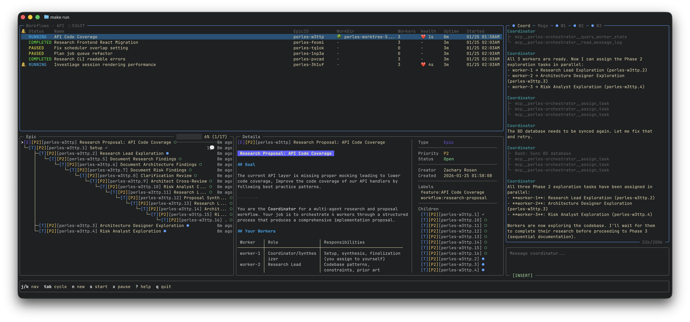
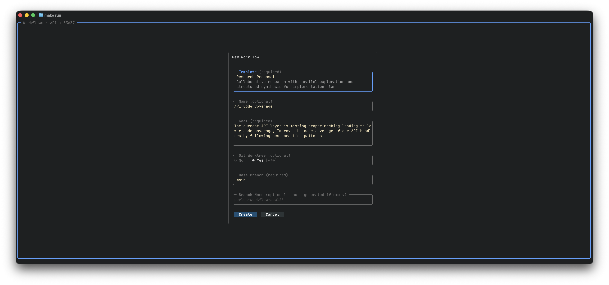

# Orchestration Control Plane

> **WARNING** Orchestration mode is not cheap it spawns multiple headless AI agents to plan, investigate, and execute tasks.
> If you care about money **DO NOT** use orchestration mode. Every headless agent runs with **FULL PERMISSIONS**.

Orchestration mode is a multi-agent control plane workspace that can launch multiple workflows in parallel where a single coordinator agent handles spawning, replacing and retiring other headless agents through
built-in MCP tools. The coordinator agent delegates sub-tasks to multiple worker agents so you don't have to manually stop and start sessions on your own. 
This allows for structured workflow instructions that can manage and orchestrate multiple headless AI agents.

- **Coordinator** A single headless agent that receives workflow instructions and manages the session.
- **Workers** Multiple headless agents who execute specific sub-tasks (coding, testing, reviewing, documenting)

<p align="center">
  
</p>

---

## Getting Started

### Configuration

The default orchestration settings use Claude Code with Opus 4.5 and by far works the best. 
You can customize these settings in your `~/.config/perles/config.yaml` but they are optional:

```yaml
orchestration:
  coordinator_client: "claude"  # Options: claude, amp, codex, opencode
  worker_client: "claude"       # Options: claude, amp, codex, opencode
  
  # Provider-specific settings
  claude:
    model: "opus"               # Options: sonnet, opus, haiku
  amp:
    model: "opus"               # Options: opus, sonnet
    mode: "smart"               # Options: free, rush, smart
  codex:
    model: "gpt-5.2-codex"      # Options: gpt-5.2-codex, o4-mini
```

### Quick Start

1. Open Perles in your project directory.
2. Press `ctrl+o` to enter orchestration mode.
3. Select a workflow template and fill in any required fields.
   - A typical coding workflow is done over multiple workflows. You would start with the  **Research Proposal** to generate a proposal document. Then launch a **Research to Tasks** to break down the proposal document into beads epics and tasks. Then launch the **Cook** workflow with that epic to work through the entire epic's tasks.

---

Any workflow supports doing work inside a git worktree. When using a worktree you can specify a different base branch to create the worktree from along with an optional branch name. If you are just doing research or converting a research proposal into an epic and tasks you likely do not have to use a worktree since you are not changing any code. 
Worktree's are primarily meant for when you are running multiple "Cook" workflows on different epics in parallel.
 
<p align="center">
  
</p>

---

## Layout

### Workflows Pane

Every workflow launched shows as a new workflow in the table which shows the status, epic id, working directory and last heartbeat status.

A workflow can be paused by pressing "x" which will stop all the running processes for the selected workflow and can be resumed with "s". 
New workflows are started by pressing "n" when the workflows table is in focus.

### Coordinator Pane

The headless AI agent process that plans and delegates work to the workers based on workflow instructions. You can communicate to the coordinator using the chat input.

**What you see:**
- Status indicator showing coordinator state
- Token usage metrics (context consumption)
- Queue count when messages are pending
- Full conversation history

**Status indicators:**
| Icon | Meaning |
|------|---------|
| `●` (blue) | Working — actively processing |
| `○` (green) | Ready — waiting for input |
| `⏸` | Paused — workflow paused |
| `⚠` (yellow) | Stopped — needs attention |
| `✗` (red) | Failed — error occurred |

#### Message Log (Tab)

The timeline of all inter-agent communication. Workers post to the message log when they finish their turns which nudges the coordinator to read and act.
Workers are automatically enforced to end their turn with an MCP tool call to post their message to the log, if they do not use a tool call the system will
intercept and remind them to do so.

**What you see:**
- Timestamps for each message
- Sender → Recipient labels

#### Worker Panes (Tabs)

When workers are spawned they are shown as tabs in the coordinator pane which you can view the output of each individual AI agent process.

**What you see for each worker:**
- Worker ID and name (e.g., `WORKER-1 perles-abc.1`)
- Current phase: `(impl)`, `(review)`, `(commit)`, etc.
- Status indicator (same icons as coordinator)
- Token/cost metrics
- Output content

**Worker phases:**

When using the Cook workflow template workers have additional phases to indicate their current activity:

| Phase | Meaning |
|-------|---------|
| `idle` | Waiting for assignment |
| `impl` | Implementing a task |
| `review` | Reviewing work |
| `await` | Awaiting feedback |
| `feedback` | Addressing feedback |
| `commit` | Committing changes |

#### Chat Input Bar

Text input area for sending messages to the coordinator or workers. 

**Visual feedback:**
- Border color indicates your message target:
  - **Teal** = Sending to coordinator
  - **Green** = Sending to a specific worker
  - **Orange** = Broadcasting to all
- When vim_mode is enabled shows which vim mode you are in for the text input.

### Epic Tree and Details

Every workflow is powered by a backing beads epic, this allows you to see progress being made of a workflow and view the details of each task of the epic. 

The "Cook" workflow is the only special workflow which uses an existing epic for its work versus the other workflows which create an epic on their own.

---

## Workflow Templates

Workflow templates are pre-defined "recipes" for common orchestration patterns they are DAGs configured via yaml files which are
then converted into a beads epic and tasks.

### Built-in Templates

| Template | Description |
|----------|-------------|
| **Cook** | Sequential task execution with code review |
| **Research to Tasks** | Research a topic and convert findings to actionable tasks |
| **Debate** | Multi-agent debate for exploring solutions |
| **Mediated Investigation** | Structured investigation with mediator |
| **Research Proposal** | Collaborative proposal development |
| **Quick Plan** | Rapid planning and task breakdown |

### Creating Custom Templates

Create your own templates in `~/.perles/workflows/{your_workflow_name}` and they will be loaded into the workflow picker automatically.

Templates consist of a `template.yaml` file that specifies the DAG for the epic and its tasks and custom arguments that can be used in templates. 
And individual task markdown files that are referenced in the yaml file.

#### Template YAML Fields

**Registration Fields (Top-Level)**

| Field | Type | Required | Description                                                                                                                                                        |
|-------|------|----------|--------------------------------------------------------------------------------------------------------------------------------------------------------------------|
| `namespace` | string | Yes      | Always `"workflow"` for workflow templates                                                                                                                         |
| `key` | string | Yes      | Unique identifier for the workflow (e.g., `"joke-contest"`)                                                                                                        |
| `version` | string | Yes      | Version identifier (e.g., `"v1"`)                                                                                                                                  |
| `name` | string | Yes      | Human-readable name shown in the workflow picker                                                                                                                   |
| `description` | string | Yes      | Description of what the workflow does                                                                                                                              |
| `epic_template` | string | Yes      | Filename of the markdown template for the epic content                                                                                                             |
| `system_prompt` | string | No       | Leave this empty most of the time to use the default and use the epic_template for instructions unless you want to override the system prompt for the coordinator. |
| `path` | string | No       | Path prefix for artifact inputs/outputs (example: `".spec"`)                                                                                                       |
| `labels` | list | No       | Tags for filtering (e.g., `["category:meta", "lang:go"]`)                                                                                                          |
| `arguments` | list | No       | User-configurable parameters (see Arguments table)                                                                                                                 |
| `nodes` | list | No       | DAG of workflow tasks (see Nodes table)                                                                                                                            |

**Argument Fields**

| Field | Type | Required | Description |
|-------|------|----------|-------------|
| `key` | string | Yes | Unique identifier, accessed in templates as `{{.Args.key}}` |
| `label` | string | Yes | Human-readable label for the form field |
| `description` | string | No | Help text/placeholder for the form field |
| `type` | string | Yes | Input type: `text`, `number`, `textarea`, `select`, or `multi-select` |
| `required` | bool | No | Whether the argument must be filled (default: `false`) |
| `default` | string | No | Default value for the field |
| `options` | list | Conditional | Required for `select` and `multi-select` types |

**Node Fields (DAG Tasks)**

| Field | Type | Required | Description |
|-------|------|----------|-------------|
| `key` | string | Yes | Unique identifier for the node within the workflow |
| `name` | string | Yes | Display name for the task |
| `template` | string | Yes | Filename of the markdown template for this task |
| `assignee` | string | No | Worker role (e.g., `"worker-1"`, `"human"` for human review gates) |
| `after` | list | No | Node keys this node depends on (runs after these complete) |
| `inputs` | list | No | Artifacts consumed by this node (see Artifacts table) |
| `outputs` | list | No | Artifacts produced by this node (see Artifacts table) |

**Artifact Fields (Inputs/Outputs)**

| Field | Type | Required | Description |
|-------|------|----------|-------------|
| `key` | string | Yes | Stable identifier for template access (e.g., `{{.Inputs.plan}}`) |
| `file` | string | Yes | Filename, may contain template syntax (e.g., `"{{.Date}}-report.md"`) |

`~/.perles/workflows/{your_workflow_name}/templates.yaml`
```yaml
registry:
  - namespace: "workflow"
    key: "joke-contest"
    version: "v1"
    name: "Joke Contest"
    description: "Test workflow where two workers write jokes in parallel, then a third worker judges and picks a winner"
    epic_template: "v1-joke-contest-epic.md"
    # Optional system prompt override most of the time you should leave this empty or omitted
    system_prompt: "v1-system-prompt.md"
    # Optional prefix path to the inputs / outputs
    path: ""
    labels:
      - "category:meta"

    # ═══════════════════════════════════════════════════════════════════════
    # ARGUMENTS: User-configurable parameters
    # ═══════════════════════════════════════════════════════════════════════
    arguments:
      - key: "theme"
        label: "Joke Theme"
        description: "Optional theme or topic for the jokes (e.g., programming, animals, food)"
        type: "text"
        required: false

    # ═══════════════════════════════════════════════════════════════════════
    # NODES: Workflow tasks (DAG structure)
    # ═══════════════════════════════════════════════════════════════════════
    # Phase 1: Two jokers write jokes in parallel (no dependencies)
    # Phase 2: Judge reads both jokes and picks a winner
    # ═══════════════════════════════════════════════════════════════════════
    nodes:
      # Phase 1: Parallel joke writing
      - key: "joke-1"
        name: "Joker 1 - Write Joke"
        template: "v1-joke-contest-joke-1.md"
        assignee: "worker-1"
        # No after - starts immediately

      - key: "joke-2"
        name: "Joker 2 - Write Joke"
        template: "v1-joke-contest-joke-2.md"
        assignee: "worker-2"
        # No after - runs in parallel with joke-1

      # Phase 2: Human review gate
      - key: "review"
        name: "Human Review"
        template: "v1-human-review.md"
        assignee: "human"
        after:
          - "joke-1"
          - "joke-2"

      # Phase 3: Judge picks winner
      - key: "judge"
        name: "Judge - Pick Winner"
        template: "v1-joke-contest-judge.md"
        assignee: "worker-3"
        after:
          - "review"
```

Example markdown file referencing arguments from the `template.yaml`
`~/.perles/workflows/{your_workflow_name}/v1-joke-contest-epic.md`
```markdown
# Joke Contest: {{.Name}}

You are the **Coordinator** for a joke contest workflow. Your job is to orchestrate 3 workers through a fun competition. You do not wait for the user you start immediately you are operating in headless mode.

## Context

{{- if .Args.theme}}
- **Theme:** {{.Args.theme}}
{{- else}}
- **Theme:** Any topic (no theme specified)
{{- end}}

## Your Workers

| Worker | Role | Responsibilities | Phase |
|--------|------|------------------|-------|
| worker-1 | Joker 1 | Write a joke and add it as a comment to their task | 1 |
| worker-2 | Joker 2 | Write a joke and add it as a comment to their task | 1 |
| human | Reviewer | Review jokes before judging (optional gate) | 2 |
| worker-3 | Judge | Read both jokes from task comments, pick a winner | 3 |

**NOTE:** You (the Coordinator) are NOT a worker. Start executing immediately.

## Quality Standards

- Jokes should be original and appropriate
- The judge should provide reasoning for their choice
- All jokes must be added as bd task comments (not just mentioned in chat)

## Success Criteria

A successful joke contest should have:
- Two jokes submitted as task comments (one from each joker)
- A clear winner announced by the judge
- The winning joke quoted in the judge's comment
```

---

### Slash Commands

Slash commands let you control workers directly to stop, retire, or replace them. You generally do not have to use these
but if a worker does get stuck for any reason you can stop them directly using slash commands. You can ask the coordinator
to do this as well.

| Command                | Action |
|------------------------|--------|
| `/stop <worker-id>`    | Gracefully retire a worker |
| `/retire <worker-id>`  | Gracefully retire a worker |
| `/replace <worker-id>` | Replace a worker with a fresh one |

---

## Session Management

### Sound Configuration

Perles supports audio feedback for various orchestration events. Sounds are optional and disabled by default.

**Available Sound Events**

| Event | Description                                        |
|-------|----------------------------------------------------|
| `review_verdict_approve` | Plays when a review is approved in a cook workflow |
| `review_verdict_deny` | Plays when a review is denied in a cook workflow   |
| `user_notification` | Plays when user attention is needed                |
| `worker_out_of_context` | Plays when a worker runs out of context            |
| `workflow_complete` | Plays when a workflow completes                    |

**Configuration Example**

```yaml
sound:
  events:
    review_verdict_approve:
      enabled: true
      override_sounds:
        - "~/.perles/sounds/checkpoint.wav"
        - "~/.perles/sounds/proceed.wav"  # Multiple sounds = random selection
    review_verdict_deny:
      enabled: true
      override_sounds:
        - "~/.perles/sounds/denied.wav"
    workflow_complete:
      enabled: true
      override_sounds:
        - "~/.perles/sounds/complete.wav"
```

**Event Configuration Fields**

| Field | Type | Description |
|-------|------|-------------|
| `enabled` | bool | Whether to play sounds for this event |
| `override_sounds` | list | Custom sound file paths (WAV format). If multiple are provided, one is randomly selected |

---

### Session Storage

Every orchestration session data is stored centrally in your home directory `~/.perles/sessions/`

```
~/.perles/sessions/
├── sessions.json                    # Global session index
└── {project-name}/
    ├── sessions.json                # Per-project index
    └── 2026-01-12/
        └── {session-uuid}/
            ├── metadata.json
            ├── coordinator/
            ├── workers/
            └── messages.jsonl
```