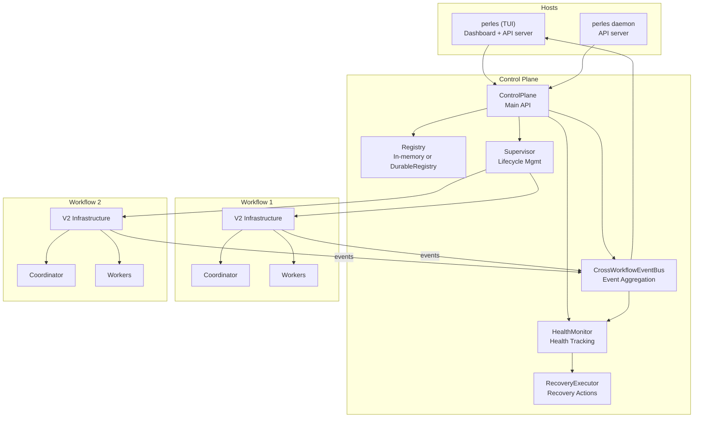
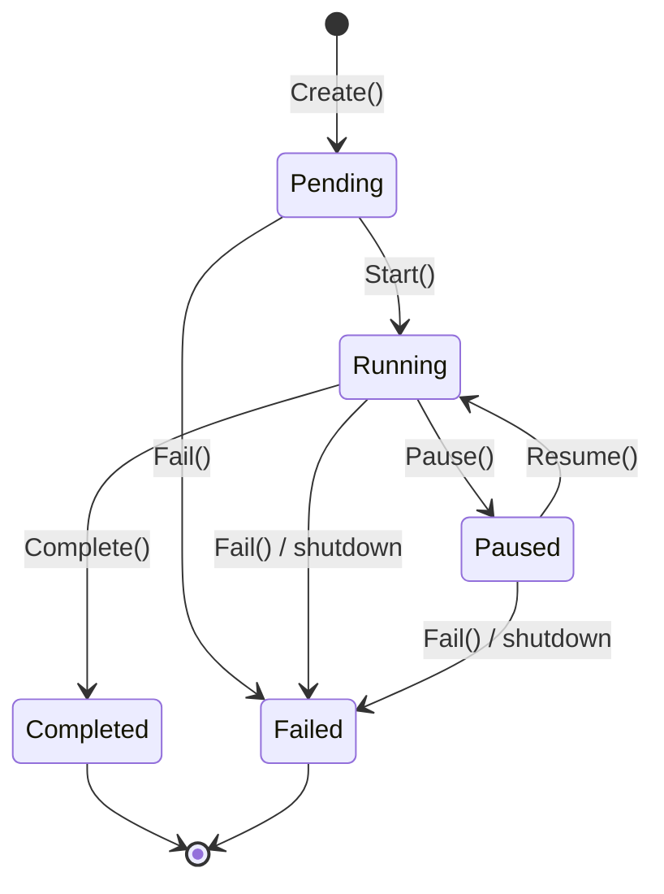

# Control Plane

The Control Plane runs multiple concurrent AI orchestration workflows within Perles. It provides centralized lifecycle management, health monitoring, an aggregated event stream, and an HTTP API. It is the engine behind [Orchestration](orchestration/index.md) and the Dashboard.

## Overview

The Control Plane provides:

- **Multi-Workflow Support**: Run multiple concurrent workflows on different epics/tasks, each with its own coordinator, workers, MCP server, and session
- **Resource Tracking**: Per-workflow MCP server port, session directory, optional git worktree, and active worker count (there are no limits on workflows, workers, or tokens)
- **Persistence**: Optional SQLite-backed registry for cold resume and archiving across restarts
- **Health Monitoring**: Detection of stuck workflows, with automatic coordinator nudges in the TUI
- **Dashboard TUI**: Bird's-eye view of all workflows with quick actions
- **Event Aggregation**: Unified event stream from all workflows
- **HTTP API**: REST and Server-Sent Events under `/api/v1`, served by the TUI and by `perles daemon`

The Control Plane lives in `internal/orchestration/controlplane/`. The Kanban/Search chat panel does not use it.

---

## Architecture



### Core Components

| Component | Purpose |
|-----------|---------|
| **ControlPlane** | Main entry point for workflow lifecycle management (`NewControlPlane`) |
| **Registry** | Stores and queries workflow instances. In-memory by default (always for `perles daemon`); SQLite-backed `DurableRegistry` (`~/.perles/perles.db`) in the TUI when the `session-persistence` flag is enabled |
| **Supervisor** | Allocates a workflow's resources, spawns its coordinator, and pauses, resumes, and shuts it down |
| **HealthMonitor** | Tracks heartbeats and progress from the event stream and detects stuck workflows |
| **RecoveryExecutor** | Executes health recovery actions (nudge, replace, pause, fail) for stuck workflows |
| **CrossWorkflowEventBus** | Aggregates events from all workflows and republishes them as `ControlPlaneEvent`s |
| **API Server** | HTTP API (`controlplane/api`) plus the web session viewer, served by the TUI and `perles daemon` |

### Where the Control Plane Runs

- **TUI (`perles`)**: The control plane and its API server are created the first time you open the dashboard. Leaving the dashboard does not stop workflows. They are shut down when Perles exits (10-second timeout).
- **`perles daemon`**: A headless control plane with no TUI; it serves the HTTP API and the web session viewer. It always uses the in-memory registry, and workflows are shut down on `SIGINT`/`SIGTERM` (30-second timeout). See [HTTP API](#http-api).

### Workflow Resources

`Start()` runs the Supervisor in two phases. `AllocateResources` sets up, in order:

1. **Git worktree** (optional). `new` mode creates a worktree on a new branch (custom name, or `perles-workflow-<first 8 chars of the workflow ID>`) from the chosen base branch, with the `orchestration.timeouts.worktree_creation` timeout. `existing` mode uses an existing worktree directory and only logs a warning if it has uncommitted changes. The workflow's working directory becomes the worktree path.
2. **MCP listener** on `127.0.0.1:0`. The OS assigns the port (`WorkflowInstance.MCPPort`), so there is no port range to configure.
3. **Session** directory at `{session_storage.base_dir}/{application_name}/{YYYY-MM-DD}/{workflow-id}/`, or the existing directory on cold resume.
4. **V2 infrastructure** (command processor, repositories, Fabric messaging), started with its own context.
5. **MCP HTTP server** serving `/mcp` (coordinator), `/worker/{id}`, and `/observer`.

`SpawnCoordinator` then spawns the coordinator with the workflow's `InitialPrompt`, spawns the observer if `orchestration.observer_enabled` is set (failures are only logged), and moves the workflow to `Running`. If `AllocateResources` fails partway, it releases what it allocated (including a worktree created in `new` mode). If `SpawnCoordinator` fails, the resources `AllocateResources` created are not released. In either phase, a failure leaves the workflow `Pending` and `Start()` returns the error.

### Registries

| Registry | Used by | Behavior |
|----------|---------|----------|
| `NewInMemoryRegistry()` | `perles daemon`; the TUI when `session-persistence` is off | Workflows exist only for the life of the process. `Archive` is a no-op |
| `NewDurableRegistry(project, sessionRepo)` | The TUI when `flags.session-persistence: true` | Workflow state is persisted to `~/.perles/perles.db`, keyed by project, and merged with in-memory runtime data |

With the `DurableRegistry`:

- **Project key**: The resolved application name (`orchestration.session_storage.application_name`, else the git `origin` repo name, else the working directory name). Changing it hides workflows persisted under the old name.
- **Cold resume**: A paused workflow loaded from SQLite has no runtime. Resuming it allocates resources again, reopens its session directory, and restores Fabric and process state before resuming the coordinator.
- **Archive**: Archived workflows are excluded from `List`.
- **Cross-process ownership**: Each workflow records the PID of the Perles process that owns it. When listing, workflows owned by a dead process are claimed by the current process. Workflows owned by another live process are marked `IsLocked`, and the dashboard refuses to start, pause, resume, rename, or archive them.

---

## Dashboard

From kanban mode, press `ctrl+o` to open the dashboard (configurable via `ui.keybindings.dashboard`). The workflow table shows a notification bell (🔔, set when the coordinator calls `notify_user`), a lock (🔒, owned by another Perles process), Status, Name, EpicID, WorkDir, Workers, Health, Uptime, and Started. For the coordinator, message log, and worker panes, see [Orchestration](orchestration/index.md#layout).

### Workflow Table Keys

| Key | Action |
|-----|--------|
| `j` / `↓` | Move down one workflow |
| `k` / `↑` | Move up one workflow |
| `g` | Go to first workflow |
| `G` | Go to last workflow |
| `tab` / `ctrl+n` | Next focus zone (workflow table → epic tree → epic details → coordinator panel). In the coordinator panel, `tab` cycles channels instead |
| `shift+tab` / `ctrl+p` | Previous focus zone |
| `/` | Activate filter |
| `esc` | Clear filter (returns to kanban if no filter is set) |
| `s` | Start the selected pending workflow, or resume it if paused |
| `x` | Pause the selected running workflow (resume with `s`) |
| `n` / `N` | Create a new workflow (it starts immediately after creation) |
| `r` | Rename the selected workflow |
| `a` | Archive the selected workflow (requires the `session-persistence` flag; not allowed while running) |
| `o` | Open the selected workflow's session in the web session viewer |
| `enter` | Open and focus the coordinator panel for the selected workflow (clears its 🔔) |
| `ctrl+w` | Toggle the coordinator panel |
| `ctrl+k` / `ctrl+j` | Previous / next tab in the coordinator panel |
| `?` | Toggle help |
| `q` / `ctrl+c` | Leave the dashboard and return to kanban |

There is no stop key. Running workflows are stopped when Perles exits.

### Epic Tree Keys

When the epic tree pane is focused:

| Key | Action |
|-----|--------|
| `j` / `k` or `↓` / `↑` | Move in the tree |
| `enter` | Refocus the tree on the selected issue |
| `d` | Toggle direction (down: children and issues it blocks; up: parent and blockers) |
| `m` | Toggle mode (deps/children) |
| `y` | Copy the issue ID |
| `l` / `→` | Focus the details pane |
| `ctrl+e` | Edit the selected issue |

When the details pane is focused:

| Key | Action |
|-----|--------|
| `j` / `k` / `g` / `G` | Scroll |
| `h` / `←` | Focus the tree pane |
| `y` | Copy the issue description |
| `c` | Add a comment |
| `ctrl+e` | Edit the selected issue |

In either pane, `?` toggles help, `ctrl+w` toggles the coordinator panel, and `q` / `ctrl+c` / `esc` return to kanban.

---

## Workflow States

| State | Description |
|-------|-------------|
| `Pending` | Created but not yet started (or a start attempt failed) |
| `Running` | Actively executing |
| `Paused` | Processes stopped and queues cleared; the infrastructure stays allocated (or is re-created on cold resume) |
| `Completed` | The coordinator signaled completion |
| `Failed` | Terminal failure (explicit `Fail()`, health auto-fail if enabled, torn down during shutdown, or a persisted timed-out session) |

### State Transitions



| Transition | Triggered by |
|------------|--------------|
| Pending → Running | `Start()`: submitting the New Workflow dialog, `s` on a pending workflow, or `POST /api/v1/workflows/{id}/start` |
| Running → Paused | `Pause()`: `x`, or `POST .../pause`. `Shutdown()` also pauses running workflows first |
| Paused → Running | `Resume()`: `s` on a paused workflow, or `POST .../resume`. Workers are resumed first, then the coordinator, which receives a system message explaining that the workflow was paused and resumed |
| Running → Completed | The coordinator calls the `signal_workflow_complete` MCP tool (with any status: `success`, `partial`, or `aborted`), which triggers `Complete()` |
| → Failed | `Fail()` (Go API only; nothing in Perles currently triggers it), health auto-fail (`EnableAutoFail`, off in the TUI and the daemon), or `Shutdown()` tearing a workflow down |

`Completed` and `Failed` are terminal. `Shutdown()` marks torn-down workflows `Failed` only in memory. With the `DurableRegistry`, the paused state saved just before teardown is what gets persisted, so those workflows come back as `Paused` and can be cold-resumed.

---

## Configuration

The Control Plane has no configuration section of its own. There are no limits on concurrent workflows, workers, AI calls, or tokens, and MCP ports are assigned by the OS. The health policy is hardcoded (see [Health Monitoring](#health-monitoring)).

The settings that affect it:

| Option | Default | Effect |
|--------|---------|--------|
| `orchestration.api_port` | `0` | Port for the HTTP API server of the TUI and `perles daemon` (`0` = auto-assign). `-p/--port` on either command overrides it |
| `orchestration.timeouts.worktree_creation` | `30s` | Timeout for creating a workflow's git worktree |
| `orchestration.session_storage.base_dir` | `$HOME/.perles/sessions` | Root directory for workflow sessions |
| `orchestration.session_storage.application_name` | derived | Application directory for sessions, and the `DurableRegistry` project key |
| `orchestration.coordinator_client` / `worker_client` | `client`, else `claude` | AI clients for the coordinator and workers |
| `orchestration.observer_enabled` / `observer_client` | `false` / `claude` | Spawn an observer after the coordinator |
| `orchestration.tracing.*` | disabled | OpenTelemetry spans for workflow commands and coordinator MCP tool calls |
| `flags.session-persistence` | `false` | Use the SQLite-backed `DurableRegistry` in the TUI (enables cold resume and `a` to archive) |
| `ui.keybindings.dashboard` | `ctrl+o` | Key that opens the dashboard from kanban mode |

```yaml
orchestration:
  api_port: 19999                 # Fixed API port instead of auto-assign
  timeouts:
    worktree_creation: 60s        # Allow slower worktree checkouts
  session_storage:
    base_dir: ~/.perles/sessions  # Leading ~ is expanded; must be absolute
    application_name: my-app

flags:
  session-persistence: true       # Persist dashboard workflows to ~/.perles/perles.db
```

See the [Configuration Reference](configuration/index.md#orchestration) for all orchestration, [tracing](configuration/index.md#tracing), and [feature flag](configuration/index.md#feature-flags) options.

---

## Health Monitoring

### How Health Is Tracked

The HealthMonitor subscribes to the control-plane event bus:

- Any forwarded `events.ProcessEvent` counts as a **heartbeat**. Only worker `ProcessOutput` events count as **progress**, which also resets the recovery count. Coordinator output does not count, since it could be a reply to a nudge.
- A workflow is tracked from its first process event and untracked when the coordinator signals completion. Paused workflows stay tracked.
- Every check interval, the monitor marks a workflow unhealthy if it has had no events for longer than `HeartbeatTimeout`, and stuck if it has had no progress for longer than `ProgressTimeout`.
- If a `RecoveryExecutor` is configured, a stuck workflow goes through this escalation: nudge (up to `MaxNudges` times, if `EnableAutoNudge`), then replace the coordinator (if `EnableAutoReplace`), then pause (if `EnableAutoPause`), then fail (if `EnableAutoFail`, once `MaxRecoveries` is reached). Attempts are at least `RecoveryBackoff` apart. When no action is left, the workflow stays `Running` in a "limbo" state.
- A nudge sends the coordinator a `[SYSTEM] Automatic System Health Check` message asking it to check worker status and its Fabric inbox, and to call `notify_user` if it is blocked.

Current health is available from `ControlPlane.GetHealthStatus(id)` (`IsHealthy`, `RecoveryCount`, `LastHeartbeatAt`, `LastProgressAt`, `LastRecoveryAt`), from the `is_healthy`, `recovery_count`, `last_heartbeat_at`, and `last_progress_at` fields in the HTTP API, and in the dashboard's Health column. That column shows `❤️ <time since last event>`, `💀 <time>` once `HeartbeatTimeout` is exceeded, or `-` for workflows that are not running or not yet tracked.

### Health Policy

The policy is a Go `HealthPolicy` struct set in code. It cannot be set in `config.yaml`. To change it, edit `createControlPlane` in `internal/app/app.go` (TUI) or `createDaemonControlPlane` in `cmd/daemon.go`.

| Setting | TUI (`perles`) | `perles daemon` |
|---------|----------------|-----------------|
| `HeartbeatTimeout` | 2m | 2m |
| `ProgressTimeout` | 2m | 10m |
| `MaxRecoveries` | 3 | 3 |
| `RecoveryBackoff` | 2m | 30s |
| `EnableAutoNudge` / `MaxNudges` | on / 3 | off / 0 |
| `EnableAutoReplace`, `EnableAutoPause`, `EnableAutoFail` | off | off |
| `CheckInterval` | 10s (default) | 30s |
| `RecoveryExecutor` | configured | none |
| `OnHealthEvent` callbacks | write debug-level log lines | none (events are dropped) |

The TUI values are identical to `DefaultHealthPolicy()`. In practice:

- **TUI**: A workflow with no worker output for more than 2 minutes gets its coordinator nudged, up to 3 times at least 2 minutes apart. After that it stays `Running` and writes `health.still.stuck` to the debug log every 2 minutes. It is never replaced, paused, or failed automatically.
- **Daemon**: Health is only tracked (for the API fields). No recovery is ever performed, and `recovery_count` stays 0.

### Health Events

Health signals are **not** published on the `ControlPlaneEvent` stream (`Subscribe`, SSE). They are delivered as `HealthEvent` values to the `OnHealthEvent` callbacks on `HealthMonitorConfig` and `RecoveryExecutorConfig`:

| `HealthEventType` | Emitted by | Meaning |
|-------------------|------------|---------|
| `health.heartbeat.missed` | HealthMonitor | No events for longer than `HeartbeatTimeout`; sets `IsHealthy = false` |
| `health.stuck.suspected` | HealthMonitor | No progress for longer than `ProgressTimeout` while `RecoveryCount` is 0 |
| `health.still.stuck` | HealthMonitor | Stuck with no recovery action left (at most once per `RecoveryBackoff`) |
| `health.recovery.started` | RecoveryExecutor | A recovery action (`RecoveryAction` field: nudge, replace, pause, fail) is starting |
| `health.recovery.succeeded` | RecoveryExecutor | The action ran without error (not that the workflow recovered) |
| `health.recovery.failed` | RecoveryExecutor | The action failed, for example a nudge to a paused workflow |

The `EventHealthUnhealthy`, `EventHealthStuck`, `EventHealthRecovering`, and `EventHealthRecovered` event types are declared but never published.

---

## Event Types

Every event on the stream is a `ControlPlaneEvent`:

```go
type ControlPlaneEvent struct {
    Type      EventType
    Timestamp time.Time

    // Workflow context
    WorkflowID   WorkflowID
    TemplateID   string
    WorkflowName string
    State        WorkflowState

    // Optional correlation IDs
    ProcessID string
    TaskID    string

    // Event-specific payload (depends on Type)
    Payload any
}
```

Lifecycle events are published directly by the ControlPlane. All other events are forwarded from each workflow's V2 event bus and classified with `ClassifyEvent`. For forwarded process events, `Payload` is an `events.ProcessEvent`. The envelope's `ProcessID` and `TaskID` are only filled when the payload has `GetProcessID()`/`GetTaskID()` methods, which `events.ProcessEvent` does not, so read them from the payload. Delivery is non-blocking: each subscriber has a small buffer, and events are dropped for subscribers that fall behind.

### Lifecycle Events

| Event Type | Value | Published when |
|------------|-------|----------------|
| `EventWorkflowCreated` | `workflow.created` | `Create()` stores a new workflow |
| `EventWorkflowStarted` | `workflow.started` | `Start()` succeeds, after resources are allocated and the coordinator is spawned. `Timestamp` is the workflow's start time and `Payload` is nil. Not published on `Resume()` or when `Start()` fails |
| `EventWorkflowPaused` | `workflow.paused` | `Pause()` succeeds |
| `EventWorkflowResumed` | `workflow.resumed` | `Resume()` succeeds |
| `EventWorkflowCompleted` | `workflow.completed` | The coordinator calls `signal_workflow_complete`. It can arrive more than once: once from `Complete()` (nil payload), plus the forwarded event (with an `events.ProcessEvent` payload) each time the tool is called |
| `EventWorkflowFailed` | `workflow.failed` | `Fail()` is called (nothing in Perles currently triggers it). Shutdown teardown and health auto-fail do not publish it |

`EventCoordinatorSpawned` is forwarded asynchronously and may arrive before or after `workflow.started`, so don't rely on their order.

### Process Events

| Event Type | Value | Source |
|------------|-------|--------|
| `EventCoordinatorSpawned` | `coordinator.spawned` | Coordinator process spawned |
| `EventCoordinatorReplaced` | `coordinator.replaced` | Coordinator process retired (replaced) |
| `EventCoordinatorOutput` | `coordinator.output` | Coordinator output, plus ready/working, status, token-usage, and queue changes, and coordinator (and observer) process errors |
| `EventCoordinatorIncoming` | `coordinator.incoming` | Message delivered to the coordinator |
| `EventWorkerSpawned` | `worker.spawned` | Worker spawned (increments `ActiveWorkers`) |
| `EventWorkerRetired` | `worker.retired` | Worker retired (decrements `ActiveWorkers`) |
| `EventWorkerOutput` | `worker.output` | Worker output, plus ready/working, status, token-usage, and queue changes |
| `EventWorkerIncoming` | `worker.incoming` | Message delivered to a worker |
| `EventObserverSpawned` | `observer.spawned` | Observer spawned |
| `EventObserverOutput` | `observer.output` | Observer output, state changes, and incoming messages |
| `EventTaskFailed` | `task.failed` | A worker process reported an error |
| `EventUserNotification` | `user.notification` | The coordinator called `notify_user` (sets the dashboard 🔔) |
| `EventFabricPosted` | `fabric.posted` | Fabric (inter-agent messaging) event; payload is a `fabric.Event` |
| `EventCommandLog` | `command.log` | One per processed V2 command; payload is a `processor.CommandLogEvent` (shown in the dashboard in debug mode) |
| `EventUnknown` | `unknown` | Any other forwarded payload |

`EventTaskAssigned` and `EventTaskCompleted` are declared but not currently emitted. For health events, see [Health Events](#health-events).

---

## Go API

These types are in `github.com/zjrosen/perles/internal/orchestration/controlplane`. Because the package is under `internal/`, it can only be imported from within the Perles module.

### ControlPlane Interface

```go
type ControlPlane interface {
    // Create creates a new workflow instance in Pending state.
    Create(ctx context.Context, spec WorkflowSpec) (WorkflowID, error)

    // Start allocates resources, spawns the coordinator, and transitions to Running.
    Start(ctx context.Context, id WorkflowID) error

    // Pause stops all processes and clears queues; infrastructure stays allocated.
    Pause(ctx context.Context, id WorkflowID) error

    // Resume resumes processes and sends the coordinator a resume message
    // (allocating resources first on cold resume).
    Resume(ctx context.Context, id WorkflowID) error

    // Complete marks a workflow as completed and persists the final state.
    Complete(ctx context.Context, id WorkflowID) error

    // Fail marks a workflow as failed and persists the final state.
    Fail(ctx context.Context, id WorkflowID) error

    // Get retrieves a workflow by ID (ErrWorkflowNotFound if missing).
    Get(ctx context.Context, id WorkflowID) (*WorkflowInstance, error)

    // List returns workflows matching the query, newest first.
    List(ctx context.Context, q ListQuery) ([]*WorkflowInstance, error)

    // Registry returns the underlying workflow registry.
    Registry() Registry

    // Archive hides a workflow from List (DurableRegistry only; no-op in memory).
    Archive(ctx context.Context, id WorkflowID) error

    // Subscribe returns all control plane events. Call the returned func to unsubscribe.
    Subscribe(ctx context.Context) (<-chan ControlPlaneEvent, func())

    // SubscribeWorkflow returns events for a single workflow.
    SubscribeWorkflow(ctx context.Context, id WorkflowID) (<-chan ControlPlaneEvent, func())

    // SubscribeFiltered returns events matching the filter.
    SubscribeFiltered(ctx context.Context, filter EventFilter) (<-chan ControlPlaneEvent, func())

    // GetHealthStatus returns false if the workflow is not tracked by the HealthMonitor.
    GetHealthStatus(id WorkflowID) (HealthStatus, bool)

    // Shutdown stops the HealthMonitor, stops every running or paused workflow
    // owned by this process, and closes the event bus.
    Shutdown(ctx context.Context) error
}
```

`Start`, `Pause`, `Resume`, `Complete`, `Fail`, and `Get` return `ErrWorkflowNotFound` for unknown IDs. Supervisor state errors wrap `ErrInvalidState` (for example, pausing a workflow that is not running). `Shutdown` reports `ErrUncommittedChanges` for a workflow whose worktree has uncommitted changes and leaves that workflow's resources in place.

`NewControlPlane` requires a `Registry` and a `Supervisor`. If `EventBus` is nil, a new `CrossWorkflowEventBus` is created. `HealthMonitor` is optional and is stopped by `Shutdown`, but you must start it yourself.

```go
type ControlPlaneConfig struct {
    Registry      Registry
    Supervisor    Supervisor
    EventBus      *CrossWorkflowEventBus // optional
    HealthMonitor HealthMonitor          // optional
}
```

### WorkflowSpec

`Create` rejects a spec with an empty `TemplateID` (`template_id is required`) or `InitialPrompt` (`initial_prompt is required`). `TemplateID` is not checked against the template registry.

```go
type WorkflowSpec struct {
    TemplateID    string // Required: workflow template key (e.g. "cook")
    InitialPrompt string // Required: initial prompt for the coordinator
    Name          string // Display name; defaults to TemplateID
    WorkDir       string // Defaults to the process's current working directory
    Labels        map[string]string
    EpicID        string // Beads epic ID associated with the workflow (optional)

    WorktreeEnabled    bool         // With an empty WorktreeMode, true means WorktreeModeNew
    WorktreeMode       WorktreeMode // WorktreeModeNone (""), WorktreeModeNew ("new"), WorktreeModeExisting ("existing")
    WorktreePath       string       // Existing worktree path (WorktreeModeExisting only)
    WorktreeBaseBranch string       // Base branch for a new worktree
    WorktreeBranchName string       // Custom branch name; auto-generated if empty
}
```

The coordinator receives `InitialPrompt` as-is. The dashboard and the HTTP API build it from the template's system prompt plus an epic section that tells the coordinator to run `bd show <epic>` (`bd show <epic> --json` from the dashboard). A new worktree is only created if the Supervisor has a `GitExecutorFactory`.

### WorkflowInstance

```go
type WorkflowInstance struct {
    // Identity
    ID         WorkflowID // UUID
    TemplateID string
    Name       string

    // Configuration
    WorkDir       string
    InitialPrompt string
    EpicID        string

    // Worktree configuration (from WorkflowSpec)
    WorktreeEnabled    bool
    WorktreeMode       WorktreeMode
    WorktreeBaseBranch string
    WorktreeBranchName string

    // Worktree state (set by AllocateResources)
    WorktreePath   string
    WorktreeBranch string

    // Session directory (reopened on cold resume)
    SessionDir string

    // State: pending, running, paused, completed, failed
    State  WorkflowState
    Labels map[string]string

    // Timestamps
    CreatedAt   time.Time
    StartedAt   *time.Time
    PausedAt    time.Time  // zero if never paused
    CompletedAt *time.Time // set by Complete() and Fail()
    UpdatedAt   time.Time

    // Runtime (set when the workflow is started)
    Infrastructure *v2.Infrastructure
    Session        *session.Session
    HTTPServer     *http.Server
    MCPCoordServer *mcp.CoordinatorServer
    FabricBroker   *fabric.Broker
    FabricLogger   *fabricpersist.EventLogger

    // Resource tracking
    MCPPort       int   // OS-assigned MCP server port
    TokensUsed    int64 // persisted, but not currently incremented by the control plane
    ActiveWorkers int   // updated from worker spawn/retire events

    // Health tracking (use GetHealthStatus for the monitor's view)
    LastHeartbeatAt time.Time // updated on every forwarded event
    LastProgressAt  time.Time

    // IsLocked is true when another running Perles process owns the workflow.
    IsLocked bool

    // Lifecycle context
    Ctx    context.Context
    Cancel context.CancelFunc
}
```

### ListQuery and EventFilter

```go
type ListQuery struct {
    States     []WorkflowState   // empty = all states
    Labels     map[string]string // must match all
    TemplateID string
    OwnerPID   *int              // honored by DurableRegistry only
    Limit      int               // 0 = no limit
    Offset     int
}

// All criteria are AND'd; an empty filter matches everything.
type EventFilter struct {
    Types        []EventType  // include only these types
    WorkflowIDs  []WorkflowID // include only these workflows
    ExcludeTypes []EventType  // applied after Types
}
```

### Registry Interface

```go
type Registry interface {
    Put(inst *WorkflowInstance) error
    Get(id WorkflowID) (*WorkflowInstance, bool)
    Update(id WorkflowID, fn func(*WorkflowInstance)) error
    List(q ListQuery) []*WorkflowInstance
    Remove(id WorkflowID) error
    Count() map[WorkflowState]int
    Archive(id WorkflowID) error
}
```

---

## HTTP API

The same HTTP API is served by `perles daemon` and by the TUI. Routes are under `/api/v1`, on `localhost`, with no authentication.

- **`perles daemon`** listens on `--port`/`-p` if given, else `orchestration.api_port`, else an auto-assigned port, and prints `Perles daemon started on port <port>`.
- **TUI** starts the server the first time you open the dashboard, on `perles -p/--port` if given, else `orchestration.api_port` (`0` = auto-assign). The port is logged in the debug log (`API server started`) and used by the dashboard's `o` key.

```bash
perles daemon              # auto-assigned port (or orchestration.api_port)
perles daemon --port 19999
perles daemon -d           # also write debug.log
```

### Routes

| Method & Path | Description | Success |
|---------------|-------------|---------|
| `GET /api/v1/templates` | List workflow templates (registry namespace `workflow`), including their arguments | 200 |
| `POST /api/v1/workflows` | Create a workflow in `Pending` state (does not start it) | 201 `{"id": "..."}` |
| `GET /api/v1/workflows` | List workflows; optional `?state=running` and `?template_id=cook` | 200 |
| `GET /api/v1/workflows/{id}` | Get one workflow | 200 |
| `POST /api/v1/workflows/{id}/start` | Start a pending workflow | 204 |
| `POST /api/v1/workflows/{id}/pause` | Pause a running workflow | 204 |
| `POST /api/v1/workflows/{id}/resume` | Resume a paused workflow | 204 |
| `GET /api/v1/workflows/{id}/events` | SSE stream of one workflow's events | stream |
| `GET /api/v1/events` | SSE stream of all events | stream |
| `GET /api/v1/health` | `{"status": "ok", "workflows": [...]}` with per-workflow health | 200 |

There is no stop or delete endpoint. Errors return `{"error": "...", "code": "...", "details": "..."}`: 404 `not_found` for unknown IDs; 400 for `invalid_json`, `validation_error`, `create_failed`, `start_failed`, and `invalid_state`; 500 for `epic_creation_failed` and other failures.

`POST /api/v1/workflows` accepts:

| Field | Description |
|-------|-------------|
| `template_id` | Required. A template key from `/templates` |
| `name` | Display name (defaults to the template ID) |
| `args` | Template arguments. Required arguments are validated (`<Label> is required`) |
| `labels` | Key-value labels |
| `worktree_enabled` | Create a new git worktree |
| `worktree_base_branch` | Base branch for the worktree |
| `branch_name` | Custom worktree branch name |

As in the dashboard, an epic-driven template (a single `epic_id` argument and no nodes, such as `cook`) uses `args.epic_id`. Any other template first creates a beads epic and tasks. The workflow runs in the server's working directory. Existing-worktree mode is not available over the API.

Workflow responses include `id`, `template_id`, `name`, `state`, `initial_prompt`, `labels`, `created_at`, `started_at`, `port` (MCP port), `worktree_enabled`, `worktree_path`, `is_healthy`, `last_heartbeat_at`, `last_progress_at`, and `recovery_count`. When the HealthMonitor is not tracking a workflow, `is_healthy` is true only if it is running.

```bash
BASE=http://localhost:19999/api/v1

curl -s $BASE/templates
curl -s -X POST $BASE/workflows \
  -H 'Content-Type: application/json' \
  -d '{"template_id": "cook", "name": "Cook perles-abc", "args": {"epic_id": "perles-abc"}}'
curl -s -X POST $BASE/workflows/<id>/start
curl -N $BASE/events
```

### Event Streams

The SSE endpoints send `event: connected` first, then one `event: <type>` (for example `event: worker.output`) per `ControlPlaneEvent`, with a `: heartbeat` comment every 30 seconds. Each event's `data` is JSON with `type`, `workflow_id`, `workflow_name`, `template_id`, `state`, `timestamp`, optional `process_id`/`task_id`, and `payload`. The payload is the JSON encoding of the Go payload, so process events use Go field names such as `Type`, `ProcessID`, `Role`, and `Output`.

### Session Viewer

The same server also serves the web session viewer at `/`, with its own endpoints under `/api/` (sessions, Fabric messaging, and files). The dashboard's `o` key opens `http://localhost:<port>/?path=<session dir>`. The viewer reads sessions from `orchestration.session_storage.base_dir` (default `~/.perles/sessions`) and refuses paths outside it.

---

## Usage Examples

These examples are written for code inside the Perles module.

### Creating a Control Plane

This is a minimal version of `createDaemonControlPlane` in `cmd/daemon.go`. The daemon also sets `WorkflowRegistry`, `GitExecutorFactory` (required for new worktrees), `TaskExecutor`, `BeadsDir`, `SoundService`, and `Tracer`.

```go
import (
    "context"
    "fmt"

    "github.com/zjrosen/perles/internal/config"
    "github.com/zjrosen/perles/internal/orchestration/controlplane"
    "github.com/zjrosen/perles/internal/orchestration/session"

    // Register the AI client providers you use, as cmd/daemon.go does.
    _ "github.com/zjrosen/perles/internal/orchestration/client/providers/claude"
)

func newControlPlane(ctx context.Context, cfg config.Config) (controlplane.ControlPlane, error) {
    orch := cfg.Orchestration

    supervisor, err := controlplane.NewSupervisor(controlplane.SupervisorConfig{
        AgentProviders: orch.AgentProviders(),
        SessionFactory: session.NewFactory(session.FactoryConfig{
            BaseDir:         orch.SessionStorage.BaseDir,
            ApplicationName: orch.SessionStorage.ApplicationName,
        }),
        WorktreeTimeout: orch.Timeouts.WorktreeCreation,
    })
    if err != nil {
        return nil, fmt.Errorf("creating supervisor: %w", err)
    }

    registry := controlplane.NewInMemoryRegistry()
    eventBus := controlplane.NewCrossWorkflowEventBus()

    // Optional: nudge stuck coordinators, as the TUI does.
    recovery, err := controlplane.NewRecoveryExecutor(controlplane.RecoveryExecutorConfig{
        WorkflowProvider: registry,
    })
    if err != nil {
        return nil, fmt.Errorf("creating recovery executor: %w", err)
    }

    healthMonitor := controlplane.NewHealthMonitor(controlplane.HealthMonitorConfig{
        Policy:           controlplane.DefaultHealthPolicy(),
        EventBus:         eventBus.Broker(),
        RecoveryExecutor: recovery,
        OnHealthEvent: func(e controlplane.HealthEvent) {
            fmt.Printf("%s %s: %s\n", e.Type, e.WorkflowID, e.Details)
        },
    })

    cp, err := controlplane.NewControlPlane(controlplane.ControlPlaneConfig{
        Registry:      registry,
        Supervisor:    supervisor,
        EventBus:      eventBus,
        HealthMonitor: healthMonitor,
    })
    if err != nil {
        return nil, fmt.Errorf("creating control plane: %w", err)
    }

    if err := healthMonitor.Start(ctx); err != nil {
        return nil, fmt.Errorf("starting health monitor: %w", err)
    }
    return cp, nil
}
```

### Creating and Starting a Workflow

```go
id, err := cp.Create(ctx, controlplane.WorkflowSpec{
    TemplateID:    "cook",
    Name:          "Cook perles-abc",
    InitialPrompt: "Work through the tasks in epic perles-abc. Run `bd show perles-abc` for details.",
    EpicID:        "perles-abc",
    Labels:        map[string]string{"epic": "perles-abc"},
})
if err != nil {
    return fmt.Errorf("creating workflow: %w", err)
}

if err := cp.Start(ctx, id); err != nil {
    // The workflow stays Pending and can be started again.
    return fmt.Errorf("starting workflow: %w", err)
}
```

### Subscribing to Events

```go
ch, unsubscribe := cp.Subscribe(ctx)
defer unsubscribe()

for event := range ch {
    switch event.Type {
    case controlplane.EventWorkflowStarted:
        fmt.Println("workflow started:", event.WorkflowID)
    case controlplane.EventCoordinatorOutput:
        if pe, ok := event.Payload.(events.ProcessEvent); ok && pe.Output != "" {
            fmt.Printf("[%s] %s\n", pe.ProcessID, pe.Output)
        }
    case controlplane.EventWorkflowCompleted:
        fmt.Println("workflow completed:", event.WorkflowID)
    }
}
```

`events` is `github.com/zjrosen/perles/internal/orchestration/events`. To watch one workflow without command logs:

```go
ch, unsubscribe := cp.SubscribeFiltered(ctx, controlplane.EventFilter{
    WorkflowIDs:  []controlplane.WorkflowID{id},
    ExcludeTypes: []controlplane.EventType{controlplane.EventCommandLog},
})
defer unsubscribe()
```

### Listing Workflows and Checking Health

```go
// List all running workflows
running, err := cp.List(ctx, controlplane.ListQuery{
    States: []controlplane.WorkflowState{controlplane.WorkflowRunning},
})
if err != nil {
    return err
}

// List workflows by label
byEpic, err := cp.List(ctx, controlplane.ListQuery{
    Labels: map[string]string{"epic": "perles-abc"},
})
if err != nil {
    return err
}
fmt.Println(len(byEpic), "workflows for perles-abc")

for _, wf := range running {
    if status, ok := cp.GetHealthStatus(wf.ID); ok {
        fmt.Printf("%s healthy=%v recoveries=%d last event %s ago\n",
            wf.Name, status.IsHealthy, status.RecoveryCount,
            time.Since(status.LastHeartbeatAt).Round(time.Second))
    }
}
```

### Pausing and Resuming

```go
if err := cp.Pause(ctx, id); err != nil {
    if errors.Is(err, controlplane.ErrInvalidState) {
        fmt.Println("workflow is not running")
    }
    return err
}

if err := cp.Resume(ctx, id); err != nil {
    return fmt.Errorf("resuming workflow: %w", err)
}
```

### Graceful Shutdown

```go
shutdownCtx, cancel := context.WithTimeout(context.Background(), 30*time.Second)
defer cancel()

if err := cp.Shutdown(shutdownCtx); err != nil {
    fmt.Println("shutdown completed with errors:", err)
}
```

---

## Troubleshooting

Most dashboard errors appear as toasts. For details, run `perles -d` (or `perles daemon -d`) and check `debug.log`.

### Workflow Stuck in "Pending"

**Symptoms**: An error toast appears after creating or starting a workflow, and it stays `Pending`.

**Possible Causes** (`Start()` returned an error):

- Git worktree creation failed: the branch is already checked out in another worktree, the worktree path already exists, or creation timed out
- The existing worktree path is missing or not a directory
- `creating MCP listener`: binding to `127.0.0.1` failed (loopback blocked by a sandbox or firewall)
- `creating session`: the session directory under `orchestration.session_storage.base_dir` could not be created
- `spawning coordinator`: the coordinator process could not be spawned (check that its AI CLI is installed and on `PATH`)
- A `🔒 Workflow is owned by another Perles process` warning toast (not a `Start()` error): another running Perles process owns the workflow, so the dashboard does not start it

**Resolution**:

1. Read the toast or the debug log and fix the git, filesystem, or provider problem
2. For slow checkouts, raise `orchestration.timeouts.worktree_creation`
3. Press `s` to retry the start

### Pause or Resume Does Nothing

**Symptoms**: Pressing `x` or `s` shows no toast and the state doesn't change.

**Cause**: The dashboard only shows toasts for wrong states (for example, `Workflow is already paused`). Errors from `Pause()` and `Resume()` themselves are not displayed.

**Resolution**: Check the debug log. A cold resume can fail while allocating resources, for example if the workflow's session directory or the existing worktree it used was deleted.

### Workflows Missing or "Failed" After a Restart

**Symptoms**: Workflows from a previous run are gone, or show as `Failed`.

**Possible Causes**:

- The in-memory registry is in use: without `flags.session-persistence: true`, workflows only live as long as the process (always true for `perles daemon`)
- `orchestration.session_storage.application_name` changed, so the `DurableRegistry` project key changed
- The workflow was archived with `a`
- A persisted session was `timed_out`, which loads as `Failed`

**Resolution**: Enable `session-persistence` and keep `application_name` stable. Session logs remain in `orchestration.session_storage.base_dir` either way.

### Workflow Shows "Running" After a Crash

**Symptoms**: With `session-persistence`, a workflow shows `Running` after Perles was killed, but nothing happens and `s` says `Workflow is already running`.

**Cause**: The persisted state is still `running`, but the workflow has no runtime in this process.

**Resolution**: Press `x` to mark it paused, then `s` to cold-resume it.

### Health Monitor False Positives

**Symptoms**: The Health column shows `💀`, or the coordinator receives `[SYSTEM] Automatic System Health Check` messages while work is progressing.

**Possible Causes**:

- Workers are running long operations without producing output (only worker output counts as progress; the TUI's `ProgressTimeout` is 2 minutes)
- The workflow is waiting on the user, so no events arrive

**Resolution**: Thresholds can't be changed in `config.yaml`. They are hardcoded in `createControlPlane` (`internal/app/app.go`) and `createDaemonControlPlane` (`cmd/daemon.go`) and need a code change. In the TUI, nudges stop after 3 attempts until worker output resets the count. A stuck workflow stays `Running` and is never failed automatically. Pause (`x`) and resume (`s`) it to re-orient the coordinator, or message the coordinator directly.

### Session Viewer or API Not Reachable

**Symptoms**: `o` opens a URL on port 0, or the API does not respond.

**Possible Causes**:

- `orchestration.api_port` is already in use, so the API server failed to start (debug log: `Failed to create API server`)
- The request is missing the `/api/v1` prefix
- The session was written under a different `session_storage.base_dir` than the one currently configured; the viewer rejects paths outside the current base dir

**Resolution**: Use a free port or `0`, and restart Perles.

---

## See Also

- [Orchestration](orchestration/index.md) - Orchestration guide
- [Workflow Templates](orchestration/workflows.md) - Built-in and community workflows
- [V2 Architecture](https://github.com/zjrosen/perles/blob/main/internal/orchestration/v2/docs/README.md) - Command processor internals
- [Configuration Reference](configuration/index.md) - Full configuration options
