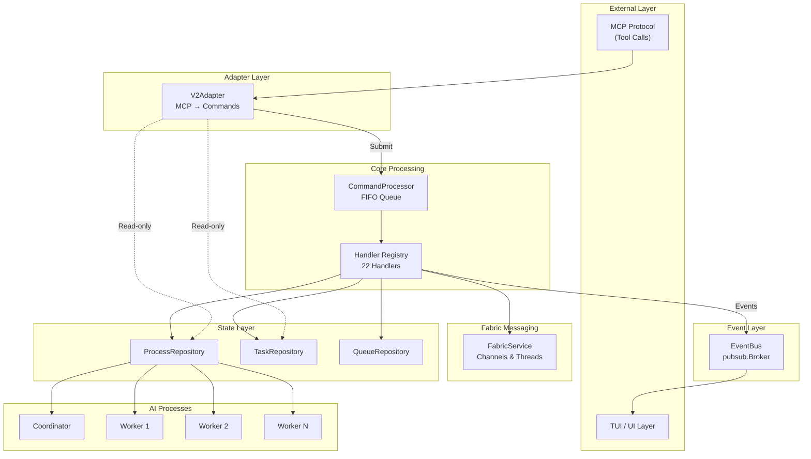
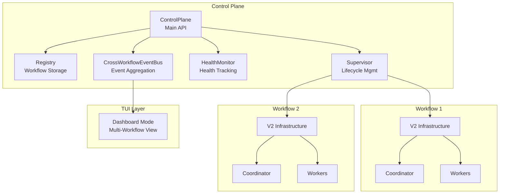

# V2 Orchestration Architecture

The v2 orchestration package provides a **command-driven, FIFO-processed** multi-agent coordination system for AI-assisted development workflows. It manages a coordinator process and multiple worker processes that collaborate on software development tasks.

## Architecture Overview



## Core Design Principles

### 1. Single-Threaded FIFO Processing
All state mutations flow through a single-threaded command processor, eliminating race conditions and ensuring deterministic execution order.

### 2. Command-Driven Architecture
Every action is represented as an explicit command with:
- Unique ID for tracing
- Command type for routing
- Validation before execution
- Source tracking (MCP, internal, callback, user)

### 3. Event Sourcing (Lite)
Handlers emit events that propagate to subscribers (TUI) via pub/sub, enabling real-time UI updates without tight coupling.

### 4. Read/Write Separation (CQRS)
- **Writes**: Go through CommandProcessor for ordering guarantees
- **Reads**: Bypass processor for low-latency direct repository access

## Package Structure

```
v2/
├── infrastructure.go         # NewInfrastructure: full stack for dashboard/daemon workflows
├── simple_infrastructure.go  # NewSimpleInfrastructure: single-process stack for the chat panel
├── adapter/                  # MCP protocol adapter (JSON → Commands)
├── command/                  # Command types and base definitions
├── handler/                  # Command handlers with business logic
├── integration/              # Message delivery to live processes via session resume (ProcessSessionDeliverer)
├── process/                  # AI process management and event loops
├── processor/                # FIFO command processor with middleware
├── prompt/                   # System prompt generation
├── repository/               # In-memory state repositories
├── types/                    # Shared types and error definitions
└── docs/                     # This documentation
```

## Key Components

| Component | Purpose |
|-----------|---------|
| **V2Adapter** | Converts MCP tool calls to typed commands |
| **CommandProcessor** | FIFO queue with handler dispatch |
| **Handlers** | 22 handlers (registered by `NewInfrastructure`) for lifecycle, messaging, tasks, state |
| **Repositories** | In-memory stores for processes, tasks, and per-process message queues |
| **EventBus** | Pub/sub broker for async TUI notification |
| **Process** | Unified struct managing AI event loops |
| **TurnCompletionEnforcer** | Ensures workers call required MCP tools each turn |

## Documentation

- [Commands and Handlers](./commands.md) - Complete command reference
- [Process Lifecycle](./process-lifecycle.md) - States, phases, and transitions
- [Message Flow](./message-flow.md) - End-to-end request processing

## Control Plane Integration

The v2 orchestration package integrates with the **Control Plane** (`internal/orchestration/controlplane/`) to support multi-workflow orchestration. The Control Plane provides:

### Architecture



### Component Responsibilities

| Component | Package | Purpose |
|-----------|---------|---------|
| **ControlPlane** | `controlplane/` | Unified API for multi-workflow lifecycle management |
| **Registry** | `controlplane/` | Workflow instance storage/querying: `DurableRegistry` (SQLite, `~/.perles/perles.db`) when `flags.session-persistence` is enabled, otherwise in-memory (always in-memory in `perles daemon`) |
| **Supervisor** | `controlplane/` | Allocates resources (V2 infrastructure, MCP server, session), spawns the coordinator, pauses/resumes and shuts down workflows |
| **HealthMonitor** | `controlplane/` | Detects missed heartbeats and stuck workflows; triggers recovery actions (coordinator nudges) when a `RecoveryExecutor` is configured, which the TUI does and `perles daemon` does not |
| **CrossWorkflowEventBus** | `controlplane/` | Aggregates events from all workflows for unified subscription |
| **V2 Infrastructure** | `v2/` | Per-workflow command processor, handlers, and repositories (`v2.NewInfrastructure`) |

The Kanban/Search chat panel does not go through the Control Plane. It creates its own `v2.NewSimpleInfrastructure`, a single-process stack that registers only 4 handlers (spawn, send, deliver queued, turn complete) and has no MCP server or tasks.

### Workflow Lifecycle Flow

Workflow states are `Pending`, `Running`, `Paused`, `Completed`, and `Failed`. All lifecycle methods take a `context.Context`.

1. **Create**: `ControlPlane.Create(ctx, spec)` → Workflow in `Pending` state, stored in Registry
2. **Start**: `ControlPlane.Start(ctx, id)` → Supervisor allocates resources (V2 infrastructure, MCP server, session) and spawns the coordinator → `Running`
3. **Execute**: V2 command processor handles MCP tool calls, coordinator delegates to workers
4. **Monitor**: HealthMonitor tracks heartbeats and progress, detects stuck workflows
5. **Pause/Resume**: `ControlPlane.Pause(ctx, id)` clears message queues and pauses all processes while keeping the infrastructure allocated → `Paused`. `ControlPlane.Resume(ctx, id)` resumes workers, then the coordinator, and sends the coordinator a resume message → `Running`. A paused workflow loaded from SQLite after a restart has its resources allocated again first (cold resume).
6. **Complete/Fail**: `ControlPlane.Complete(ctx, id)` / `ControlPlane.Fail(ctx, id)` → terminal `Completed` / `Failed` state, persisted to the Registry
7. **Shutdown**: `ControlPlane.Shutdown(ctx)` → Stops the HealthMonitor, then shuts down every running or paused workflow owned by this process (running ones are paused first so their state is persisted for cold resume), releases their resources, and closes the event bus. A workflow whose worktree has uncommitted changes is not shut down; its error is included in the aggregated error `Shutdown` returns

## Quick Start

### Initialization Flow

```go
// 1. Create repositories
processRepo := repository.NewMemoryProcessRepository()
taskRepo := repository.NewMemoryTaskRepository()
queueRepo := repository.NewMemoryQueueRepository(1000)

// 2. Create event bus
eventBus := pubsub.NewBroker[any]()

// 3. Create processor with dependencies
proc := processor.NewCommandProcessor(
    processor.WithEventBus(eventBus),
    processor.WithTaskRepository(taskRepo),
    processor.WithQueueRepository(queueRepo),
)

// 4. Register handlers
proc.RegisterHandler(command.CmdSpawnProcess, handler.NewSpawnProcessHandler(...))
// ... register remaining handlers

// 5. Create adapter
adapter := adapter.NewV2Adapter(proc,
    adapter.WithProcessRepository(processRepo),
    adapter.WithTaskRepository(taskRepo),
)

// 6. Start processor and wait until it accepts commands
// (Submit/SubmitAndWait return ErrQueueFull until Run has started)
go proc.Run(ctx)
if err := proc.WaitForReady(ctx); err != nil {
    return err
}
```

In production, don't wire this by hand. `infra, err := v2.NewInfrastructure(cfg)` creates all repositories, middleware, handlers, and the adapter, and `infra.Start(ctx)` runs the processor, waits for it to be ready, and initializes the Fabric session. The components are exposed as `infra.Core` (`Processor`, `Adapter`, `EventBus`, ...) and `infra.Repositories`; `infra.Shutdown()` stops all processes and drains the processor.

### Submitting Commands

```go
// Fire-and-forget
err := proc.Submit(command.NewSpawnProcessCommand(command.SourceUser, repository.RoleWorker))

// Synchronous with result
result, err := proc.SubmitAndWait(ctx, cmd)
```

### Subscribing to Events

```go
eventCh := eventBus.Subscribe(ctx)
for evt := range eventCh {
    if processEvt, ok := evt.Payload.(events.ProcessEvent); ok {
        // Handle process event
    }
}
```
