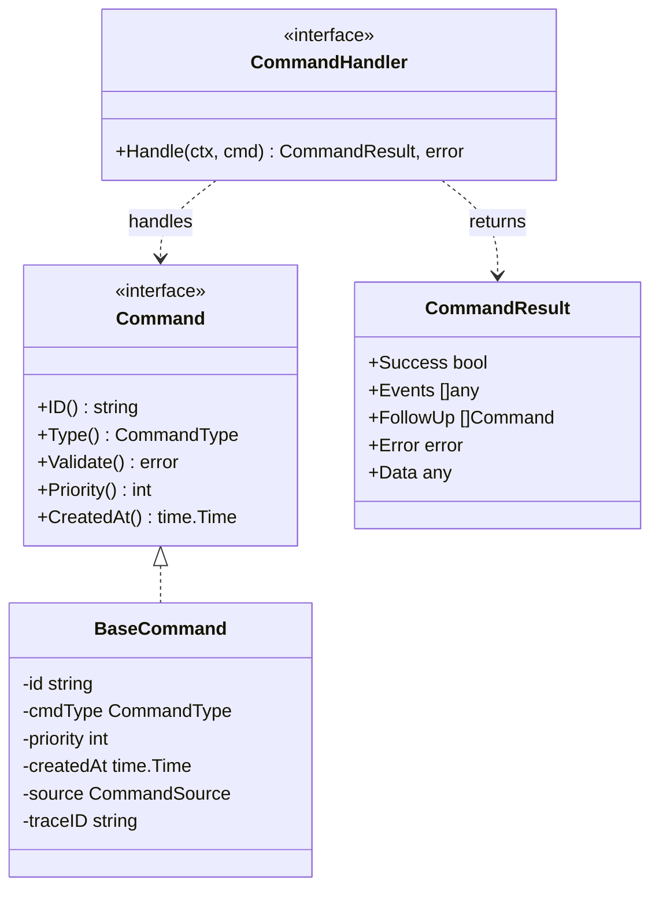
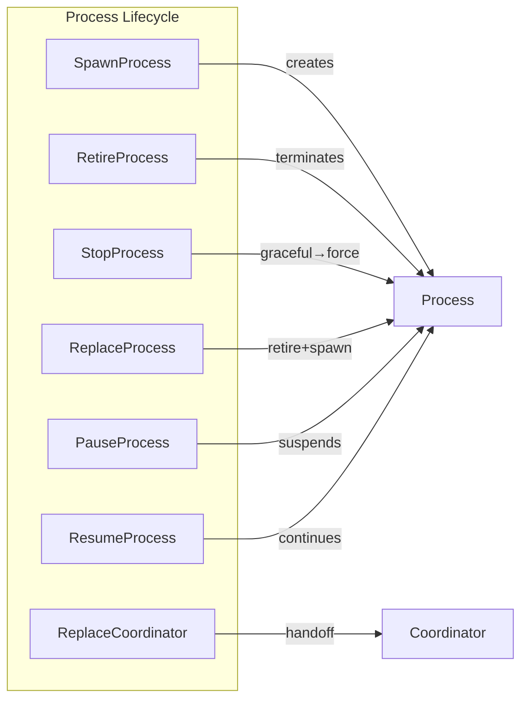
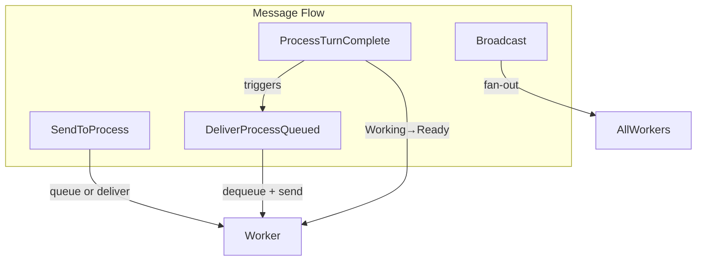
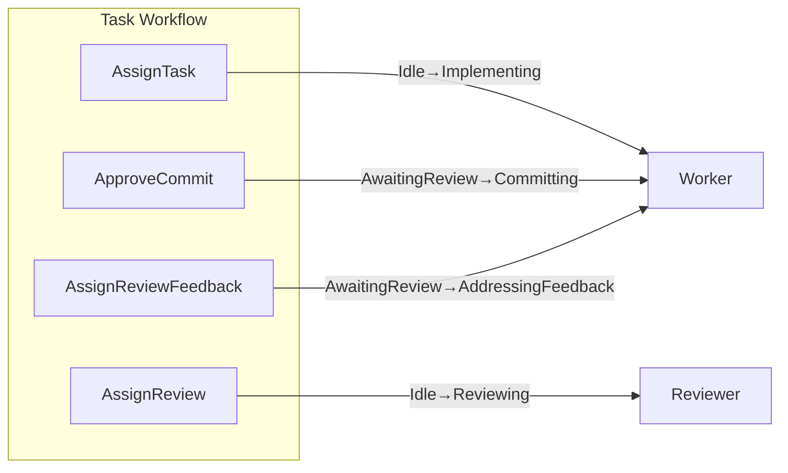
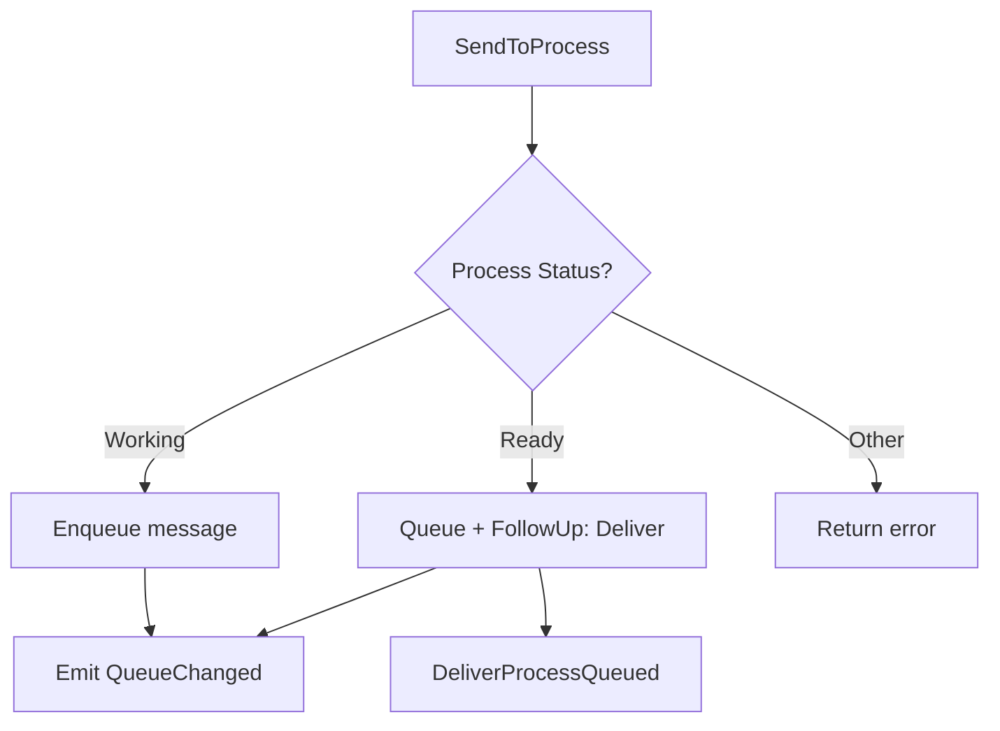
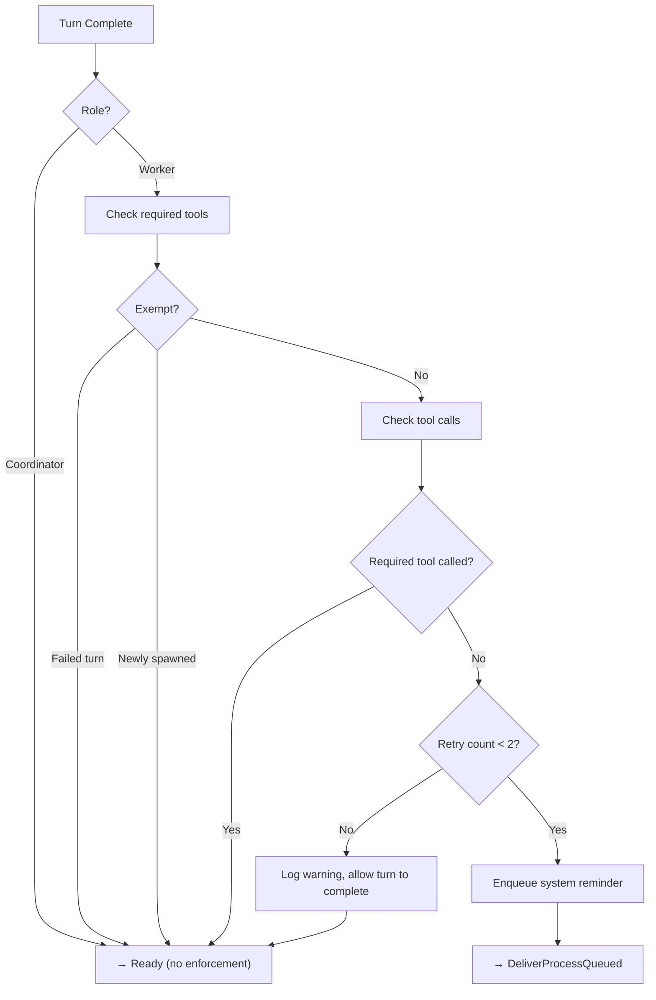
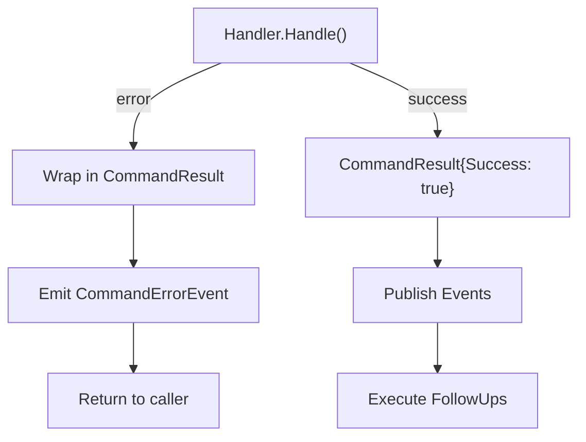

# Commands and Handlers Reference

This document describes all command types in the v2 orchestration system and their corresponding handlers.

## Command Architecture



## Command Sources

| Source | Description | Example |
|--------|-------------|---------|
| `mcp_tool` | From AI tool calls via MCP protocol | Coordinator calls `assign_task` |
| `internal` | System-generated commands | Queue drain after status change |
| `callback` | Worker state callbacks | `ProcessTurnComplete` after AI turn |
| `user` | Direct user input from TUI | Manual process control |

## Command Types by Category

### Process Lifecycle Commands



| Command | Handler | Purpose |
|---------|---------|---------|
| `CmdSpawnProcess` | `SpawnProcessHandler` | Creates new coordinator or worker process |
| `CmdRetireProcess` | `RetireProcessHandler` | Gracefully terminates a process (terminal state) |
| `CmdStopProcess` | `StopProcessHandler` | Stops process with tiered graceful→force escalation (resumable) |
| `CmdReplaceProcess` | `ReplaceProcessHandler` | Retires then respawns a process |
| `CmdReplaceCoordinator` | `ReplaceCoordinatorHandler` | Full handoff protocol with prompt transfer |
| `CmdPauseProcess` | `PauseProcessHandler` | Pauses process (Ready/Working → Paused) |
| `CmdResumeProcess` | `ResumeProcessHandler` | Resumes paused or stopped process (triggers queue drain) |

### Message Delivery Commands



| Command | Handler | Purpose |
|---------|---------|---------|
| `CmdSendToProcess` | `SendToProcessHandler` | Queue message (if working) or deliver (if ready) |
| `CmdBroadcast` | `BroadcastHandler` | Fan-out message to all workers |
| `CmdDeliverProcessQueued` | `DeliverProcessQueuedHandler` | Dequeue and deliver message to process |
| `CmdProcessTurnComplete` | `ProcessTurnCompleteHandler` | Transition Working→Ready, drain queue |

### Task Assignment Commands



| Command | Handler | Purpose |
|---------|---------|---------|
| `CmdAssignTask` | `AssignTaskHandler` | Assign BD task to idle worker |
| `CmdAssignReview` | `AssignReviewHandler` | Assign reviewer to completed task |
| `CmdApproveCommit` | `ApproveCommitHandler` | Approve implementation for commit |
| `CmdAssignReviewFeedback` | `AssignReviewFeedbackHandler` | Send denial feedback to implementer |

### State Transition Commands

| Command | Handler | Purpose |
|---------|---------|---------|
| `CmdReportComplete` | `ReportCompleteHandler` | Worker reports implementation complete |
| `CmdReportVerdict` | `ReportVerdictHandler` | Reviewer reports APPROVED/DENIED verdict |
| `CmdTransitionPhase` | `TransitionPhaseHandler` | Internal phase change with validation |

### BD Integration Commands

| Command | Handler | Purpose |
|---------|---------|---------|
| `CmdMarkTaskComplete` | `MarkTaskCompleteHandler` | Update BD task status to closed |
| `CmdMarkTaskFailed` | `MarkTaskFailedHandler` | Mark BD task failed with reason |

## Handler Details

### SpawnProcessHandler

Creates a new AI process (coordinator or worker).

**Input:**
```go
type SpawnProcessCommand struct {
    Role      ProcessRole  // RoleCoordinator or RoleWorker
    ProcessID string       // Optional custom ID
}
```

**Behavior:**
1. Validates no duplicate coordinator exists
2. Checks worker count limits
3. Generates role-specific config (prompts, MCP tools)
4. Spawns AI process via HeadlessClient
5. Registers in ProcessRegistry
6. Emits `ProcessSpawned` event

**Result Events:** `ProcessEvent{Type: ProcessSpawned}`

### StopProcessHandler

Stops a process (coordinator or worker) with tiered termination escalation.

**Input:**
```go
type StopProcessCommand struct {
    ProcessID string  // Process to stop (e.g., "coordinator", "worker-1")
    Force     bool    // Skip graceful shutdown, go straight to SIGKILL
    Reason    string  // Optional reason for stopping
}
```

**Behavior:**
1. Looks up process in repository
2. If already stopped or retired, returns success (idempotent)
3. If worker is in `Committing` phase and `Force=false`, returns warning without terminating
4. Attempts graceful shutdown via `Cancel()` with 5s timeout
5. If graceful timeout expires, escalates to `SIGKILL`
6. Updates process status to `Stopped` (can be resumed later)
7. Cleans up task assignment (clears implementer/reviewer)
8. Drains any queued messages for the process
9. Emits `ProcessStatusChange` event (and `ProcessQueueChanged` if messages were drained)

**Phase-Aware Protection:**
Workers in the `Committing` phase are protected from accidental termination. Use `Force=true` to override.

**Resumable:**
Unlike `Retired`, stopped processes can be resumed via `ResumeProcess` command.

**Result Events:** `ProcessEvent{Type: ProcessStatusChange, Status: Stopped}`, optionally `ProcessEvent{Type: ProcessQueueChanged}`

### SendToProcessHandler

Implements the **queue-or-deliver pattern**.



**Logic:**
- **Working**: Queue message, emit QueueChanged event
- **Ready**: Queue message, return `DeliverProcessQueued` as follow-up
- **Other**: Return error

### ProcessTurnCompleteHandler

Called when AI process completes a turn.

**Flow:**
1. Transition status Working → Ready
2. Update token metrics
3. **[Workers only] Turn completion enforcement** (see below)
4. Check message queue
5. If queue not empty, return `DeliverProcessQueued` follow-up
6. Emit `ProcessReady` event

#### Turn Completion Enforcement (Workers Only)

Workers must call one of the required MCP tools to properly complete their turn:
- `post_message` - Send message to coordinator
- `report_implementation_complete` - Report task completion
- `report_review_verdict` - Report review result
- `signal_ready` - Signal ready for work (after startup)

**Enforcement Flow:**


**Sender Types:**
- `SenderUser` - Message from TUI user
- `SenderCoordinator` - Message from coordinator via MCP tool
- `SenderSystem` - Enforcement reminder from the system

**Key Behavior:**
- System reminders (`SenderSystem`) preserve the retry count across delivery
- Normal messages (`SenderUser`, `SenderCoordinator`) reset the turn state
- Maximum 2 enforcement retries before allowing turn to complete
- First turn after spawn is exempt (workers call `signal_ready`)

### AssignTaskHandler

Assigns a BD task to an idle worker.

**Preconditions:**
- Worker must be in Ready status
- Worker must be in Idle phase
- Worker must not already have a task

**Actions:**
1. Validate worker state
2. Create TaskAssignment in repository
3. Transition phase Idle → Implementing
4. Queue task prompt to worker
5. Call `BDExecutor.UpdateTaskStatus("in_progress")`
6. Emit `ProcessPhaseChange` event
7. Return `DeliverProcessQueued` follow-up

## Command Validation

Every command implements `Validate()` for pre-execution checks:

```go
func (c *AssignTaskCommand) Validate() error {
    if c.WorkerID == "" {
        return fmt.Errorf("worker_id is required")
    }
    if c.TaskID == "" {
        return fmt.Errorf("task_id is required")
    }
    if !validation.IsValidTaskID(c.TaskID) {
        return fmt.Errorf("invalid task_id format: %s", c.TaskID)
    }
    return nil
}
```

## Follow-Up Commands

Handlers can return additional commands in `CommandResult.FollowUp`:

```go
// Example: ReplaceProcessHandler returns 2 follow-ups
return &CommandResult{
    Success: true,
    FollowUp: []Command{
        NewRetireProcessCommand(processID),
        NewSpawnProcessCommand(role),
    },
}, nil
```

Follow-ups are submitted to the processor queue (FIFO ordering maintained).

## Error Handling

### Sentinel Errors

```go
var (
    // Process lifecycle
    ErrProcessNotFound     = errors.New("process not found")
    ErrProcessRetired      = errors.New("process is retired")
    ErrCoordinatorExists   = errors.New("coordinator already exists")
    ErrMaxProcessesReached = errors.New("maximum processes reached")
    
    // Queue
    ErrQueueEmpty = errors.New("message queue is empty")
    
    // State transitions
    ErrInvalidPhase        = errors.New("invalid phase transition")
    ErrProcessNotReady     = errors.New("process not in ready status")
    ErrProcessNotIdle      = errors.New("process not in idle phase")
    ErrProcessAlreadyAssigned = errors.New("process already has task")
)
```

### Error Flow


