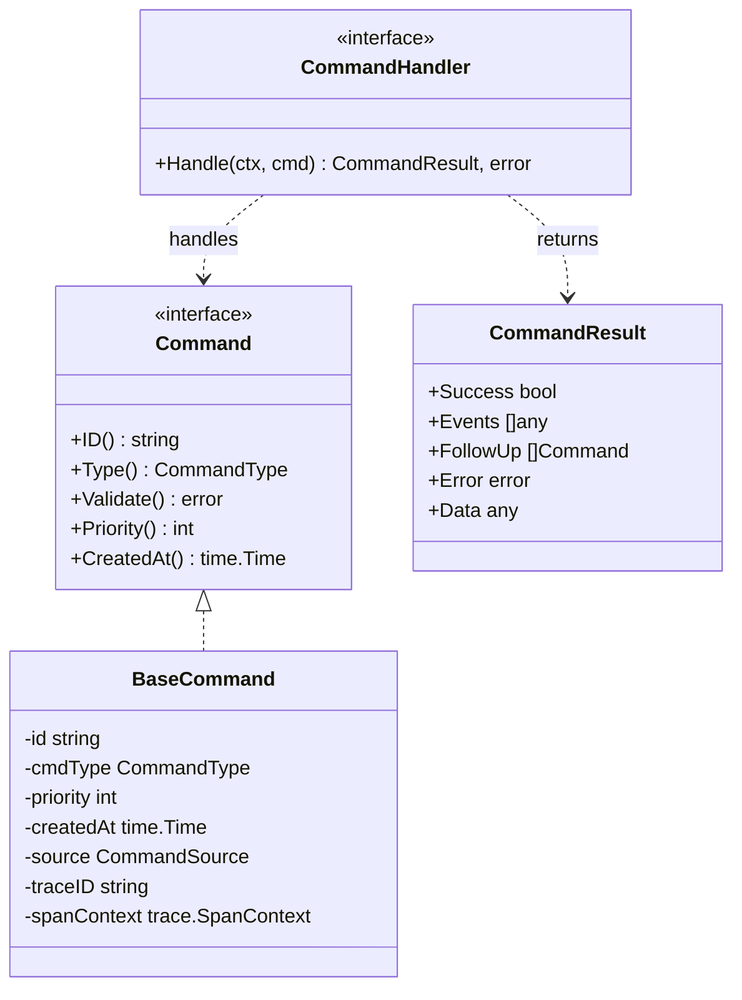
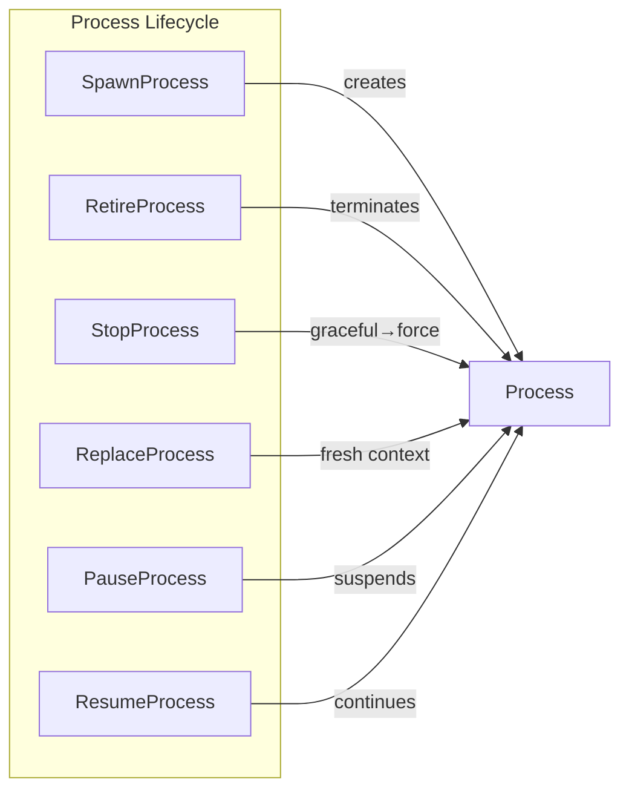
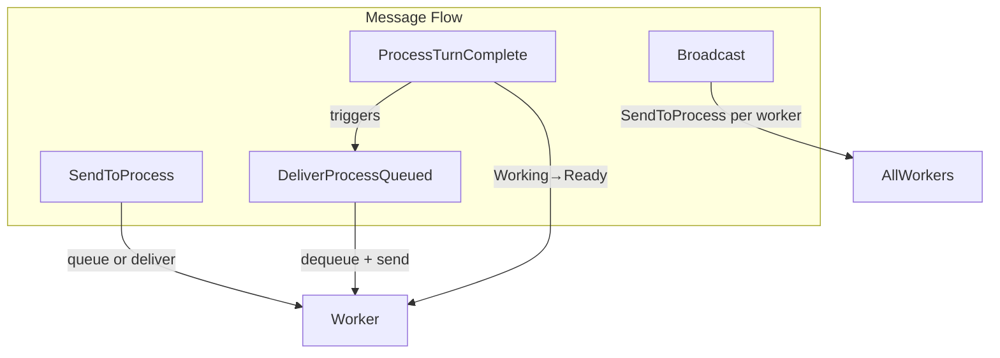
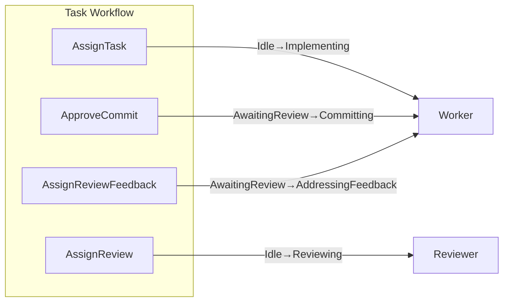
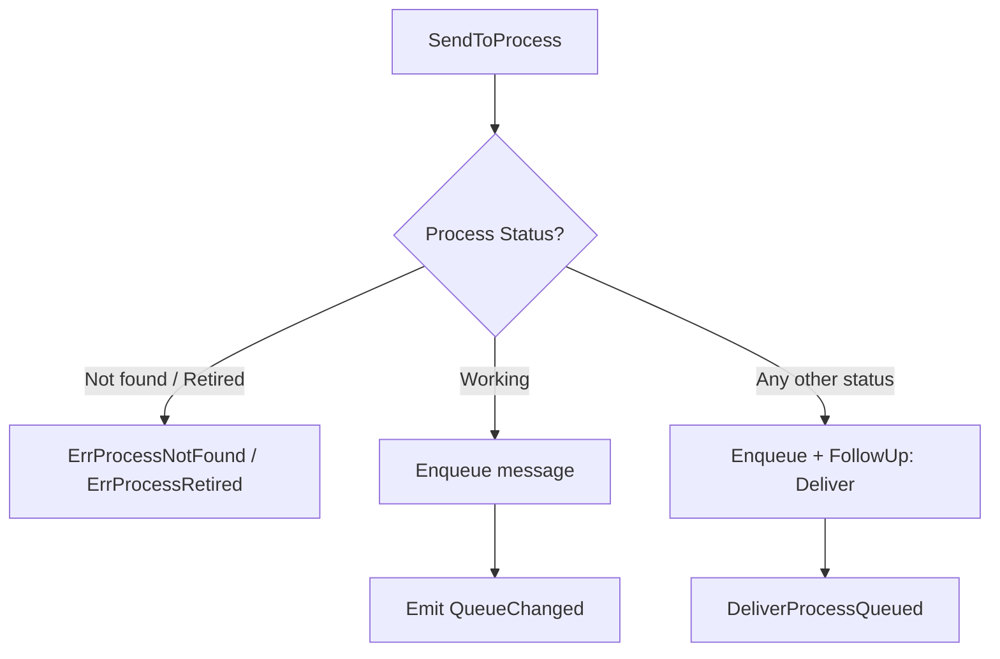
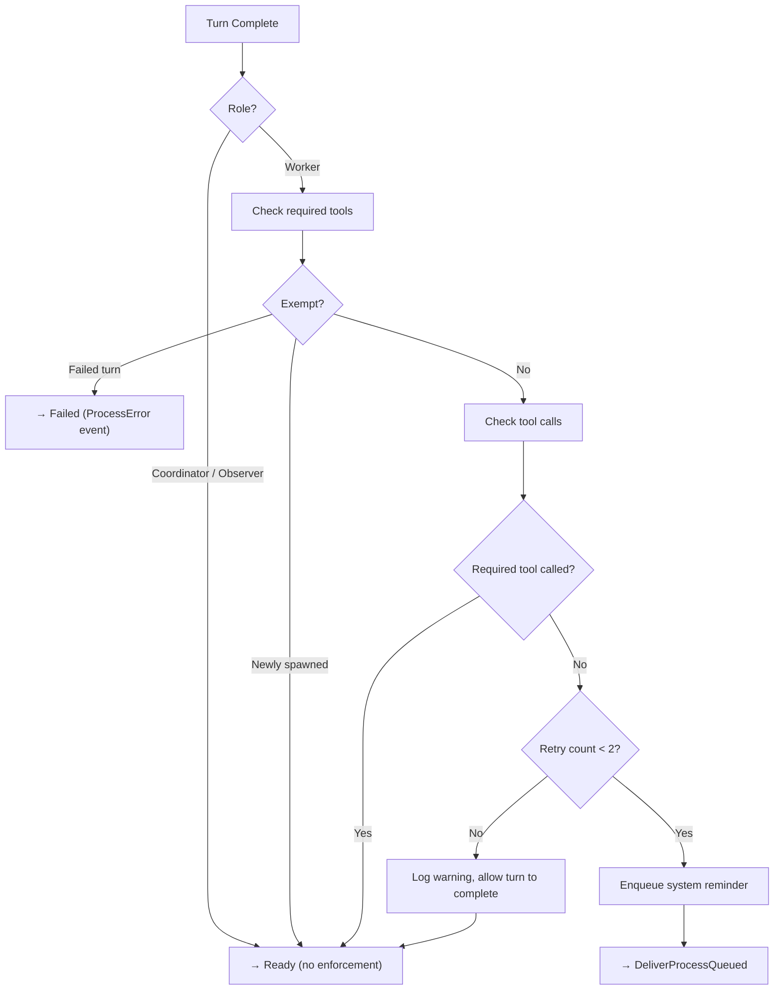
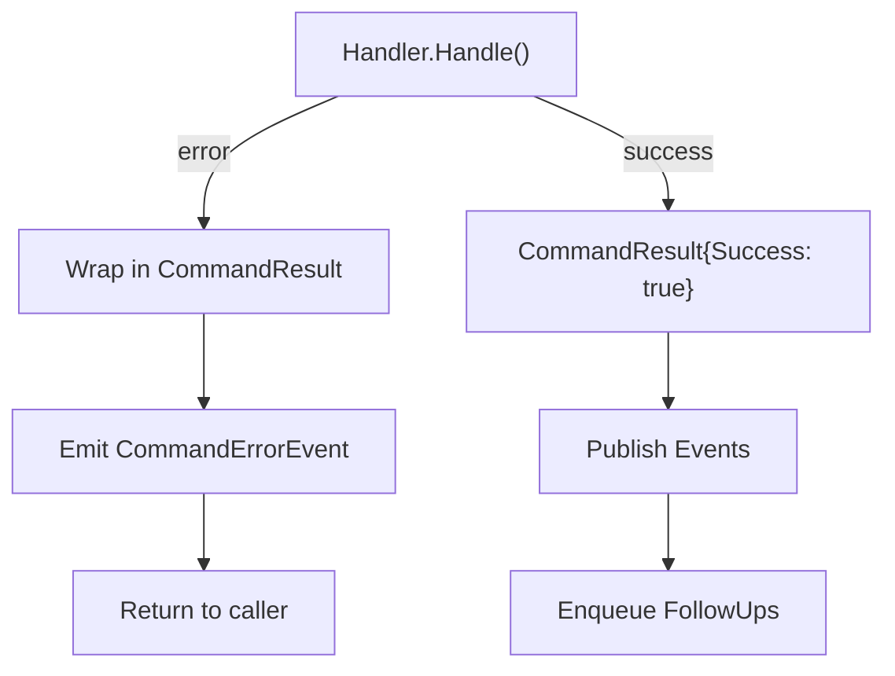

# Commands and Handlers Reference

This document describes all command types in the v2 orchestration system and their corresponding handlers.

Every handler below is registered by `NewInfrastructure` (`v2/infrastructure.go`), which dashboard and daemon workflows use. The Kanban/Search chat panel uses `SimpleInfrastructure`, which registers only `SpawnProcess`, `SendToProcess`, `DeliverProcessQueued` and `ProcessTurnComplete`; any other command submitted there fails with `ErrUnknownCommandType`.

## Command Architecture


```mermaid
classDiagram
    class Command {
        <<interface>>
        +ID() string
        +Type() CommandType
        +Validate() error
        +Priority() int
        +CreatedAt() time.Time
    }
    
    class BaseCommand {
        -id string
        -cmdType CommandType
        -priority int
        -createdAt time.Time
        -source CommandSource
        -traceID string
        -spanContext trace.SpanContext
    }
    
    class CommandResult {
        +Success bool
        +Events []any
        +FollowUp []Command
        +Error error
        +Data any
    }
    
    class CommandHandler {
        <<interface>>
        +Handle(ctx, cmd) CommandResult, error
    }
    
    Command <|.. BaseCommand
    CommandHandler ..> Command : handles
    CommandHandler ..> CommandResult : returns
```

## Command Sources

| Source | Description | Example |
|--------|-------------|---------|
| `mcp_tool` | From AI tool calls via MCP protocol | Coordinator calls `assign_task` |
| `internal` | System-generated commands | Queue drain after status change |
| `callback` | Process event-loop callbacks (any role) | `ProcessTurnComplete` after AI turn |
| `user` | Direct user input from TUI | Manual process control |

## Command Types by Category

### Process Lifecycle Commands


```mermaid
flowchart LR
    subgraph Lifecycle["Process Lifecycle"]
        Spawn["SpawnProcess"]
        Retire["RetireProcess"]
        StopProcess["StopProcess"]
        Replace["ReplaceProcess"]
        Pause["PauseProcess"]
        Resume["ResumeProcess"]
    end

    Spawn -->|creates| Process
    Retire -->|terminates| Process
    StopProcess -->|graceful→force| Process
    Replace -->|fresh context| Process
    Pause -->|suspends| Process
    Resume -->|continues| Process
```

| Command | Handler | Purpose |
|---------|---------|---------|
| `CmdSpawnProcess` | `SpawnProcessHandler` | Creates new coordinator, worker, or observer process |
| `CmdRetireProcess` | `RetireProcessHandler` | Gracefully terminates a process (terminal state) |
| `CmdStopProcess` | `StopWorkerHandler` | Stops process with tiered graceful→force escalation (resumable) |
| `CmdReplaceProcess` | `ReplaceProcessHandler` | Replaces a process with fresh context: coordinator/observer use spawn-before-retire with a handoff/resume prompt; workers are retired and replaced by a new `worker-N` |
| `CmdPauseProcess` | `PauseProcessHandler` | Pauses process (Ready/Working → Paused) |
| `CmdResumeProcess` | `ResumeProcessHandler` | Resumes paused or stopped process (triggers queue drain) |

### Message Delivery Commands


```mermaid
flowchart TB
    subgraph Messaging["Message Flow"]
        Send["SendToProcess"]
        Broadcast["Broadcast"]
        Deliver["DeliverProcessQueued"]
        TurnComplete["ProcessTurnComplete"]
    end
    
    Send -->|queue or deliver| Worker
    Broadcast -->|SendToProcess per worker| AllWorkers
    Deliver -->|dequeue + send| Worker
    TurnComplete -->|Working→Ready| Worker
    TurnComplete -->|triggers| Deliver
```

| Command | Handler | Purpose |
|---------|---------|---------|
| `CmdSendToProcess` | `SendToProcessHandler` | Queue message; deliver via follow-up unless the process is Working |
| `CmdBroadcast` | `BroadcastHandler` | Fan-out message to all active workers (one `SendToProcess` follow-up each) |
| `CmdDeliverProcessQueued` | `DeliverProcessQueuedHandler` | Dequeue and deliver message to process |
| `CmdProcessTurnComplete` | `ProcessTurnCompleteHandler` | Transition Working→Ready (or Failed), enforce worker tools, drain queue |

`CmdBroadcast` requires `Content` and accepts optional `ExcludeWorkers`. It targets every worker whose status is not Retired or Failed; the coordinator and observer never receive broadcasts. Follow-ups use `SourceInternal`, so the queued message's sender is `system`. The result is `BroadcastResult{TargetWorkers, ExcludedWorkers, MessagesSent}`. No MCP tool submits it; it is only available programmatically through the command processor.

### Task Assignment Commands


```mermaid
flowchart LR
    subgraph Assignment["Task Workflow"]
        Assign["AssignTask"]
        Review["AssignReview"]
        Approve["ApproveCommit"]
        Feedback["AssignReviewFeedback"]
    end
    
    Assign -->|Idle→Implementing| Worker
    Review -->|Idle→Reviewing| Reviewer
    Approve -->|AwaitingReview→Committing| Worker
    Feedback -->|AwaitingReview→AddressingFeedback| Worker
```

| Command | Handler | Purpose |
|---------|---------|---------|
| `CmdAssignTask` | `AssignTaskHandler` | Assign BD task to idle worker |
| `CmdAssignReview` | `AssignReviewHandler` | Assign reviewer to completed task |
| `CmdApproveCommit` | `ApproveCommitHandler` | Approve implementation for commit |
| `CmdAssignReviewFeedback` | `AssignReviewFeedbackHandler` | Send denial feedback to implementer |

### State Transition Commands

| Command | Handler | Purpose |
|---------|---------|---------|
| `CmdReportComplete` | `ReportCompleteHandler` | Worker reports implementation complete |
| `CmdReportVerdict` | `ReportVerdictHandler` | Reviewer reports APPROVED/DENIED verdict |
| `CmdTransitionPhase` | `TransitionPhaseHandler` | Internal phase change with validation |

### BD Integration Commands

| Command | Handler | Purpose |
|---------|---------|---------|
| `CmdMarkTaskComplete` | `MarkTaskCompleteHandler` | Close BD task, add "Task completed" comment, reset implementer/reviewer to Ready/Idle, delete assignment |
| `CmdMarkTaskFailed` | `MarkTaskFailedHandler` | Add a `Task failed: <reason>` comment to the BD task (status, process state and assignment unchanged) |

### Workflow & User Interaction Commands

| Command | Handler | Purpose |
|---------|---------|---------|
| `CmdGenerateAccountabilitySummary` | `GenerateAccountabilitySummaryHandler` | Queue the aggregation prompt to an existing worker (`WorkerID` and `SessionDir` required); delivered via follow-up unless the worker is Working |
| `CmdSignalWorkflowComplete` | `SignalWorkflowCompleteHandler` | Record workflow completion (`success`/`partial`/`aborted` + required summary) in session metadata, emit `ProcessWorkflowComplete` |
| `CmdNotifyUser` | `NotifyUserHandler` | Request user attention (`Message` required), request the `user_notification` sound (silent unless `sound.events.user_notification.override_sounds` is set), emit `ProcessUserNotification` |

These back the coordinator MCP tools `generate_accountability_summary`, `signal_workflow_complete` and `notify_user`. Repeated `signal_workflow_complete` calls keep the original completion timestamp and play the completion sound only once, but still emit the event.

## Handler Details

### SpawnProcessHandler

Creates a new AI process (coordinator, worker, or observer).

**Input:**
```go
type SpawnProcessCommand struct {
    *BaseCommand
    Role           repository.ProcessRole // RoleCoordinator, RoleWorker, or RoleObserver
    ProcessID      string                 // Optional custom ID (auto worker-N for workers)
    AgentType      roles.AgentType        // Optional specialization (default: generic), set via WithAgentType
    WorkflowConfig *roles.WorkflowConfig  // Optional workflow prompt customizations, set via WithWorkflowConfig
}
```

**Behavior:**
1. Enforces singleton coordinator/observer (`ErrCoordinatorExists` / `ErrObserverExists`); workers get the next `worker-N` ID unless `ProcessID` is provided (no worker count limit is enforced)
2. Saves a `Pending` process entity to ProcessRepository
3. Spawns via UnifiedProcessSpawner (role-specific prompts, MCP config) and registers in ProcessRegistry
4. Sets status to `Working` (first turn; becomes `Ready` when the turn completes)
5. Marks process newly spawned (first-turn enforcement exemption)
6. Emits `ProcessSpawned` event

**Result Events:** `ProcessEvent{Type: ProcessSpawned}`

### StopWorkerHandler

Handles `CmdStopProcess`. Stops a process (coordinator, worker, or observer) with tiered termination escalation. Constructed with `NewStopWorkerHandler`; the `WithFabricUnsubscriber` option enables observer channel cleanup.

**Input:**
```go
type StopProcessCommand struct {
    *BaseCommand
    ProcessID string  // Process to stop (e.g., "coordinator", "worker-1")
    Force     bool    // Skip graceful shutdown, go straight to SIGKILL
    Reason    string  // Optional reason for stopping
}
```

**Behavior:**
1. Looks up process in repository
2. If already stopped or retired, returns success (idempotent)
3. If worker is in `Committing` phase and `Force=false`, returns warning without terminating
4. Attempts graceful shutdown via `Cancel()` with 5s timeout (skipped when `Force=true`; if the process is not in the live registry, termination is skipped and it goes straight to steps 6-10)
5. If the graceful timeout expires (or `Force=true`), sends `SIGKILL` (`TerminateProcess` on Windows). After a graceful or forced stop, the live process's event loop is stopped
6. For observers, unsubscribes from all Fabric channels (best effort)
7. Cleans up task assignment (clears implementer/reviewer)
8. Drains any queued messages for the process
9. Clears the process `TaskID` and updates status to `Stopped` (can be resumed later)
10. Emits `ProcessStatusChange` event (and `ProcessQueueChanged` if messages were drained)

**Phase-Aware Protection:**
Workers in the `Committing` phase are protected from accidental termination. Use `Force=true` to override.

**Resumable:**
Unlike `Retired`, stopped processes can be resumed via `ResumeProcess` command.

**Result Events:** `ProcessEvent{Type: ProcessStatusChange, Status: Stopped}`, optionally `ProcessEvent{Type: ProcessQueueChanged}`

### SendToProcessHandler

Implements the **queue-or-deliver pattern**.


```mermaid
flowchart TD
    Send["SendToProcess"]
    
    Send --> Check{Process Status?}
    Check -->|Not found / Retired| Error["ErrProcessNotFound / ErrProcessRetired"]
    Check -->|Working| Queue["Enqueue message"]
    Check -->|Any other status| QueueThenDeliver["Enqueue + FollowUp: Deliver"]
    
    Queue --> EmitQueueChanged["Emit QueueChanged"]
    QueueThenDeliver --> DeliverCmd["DeliverProcessQueued"]
```

**Logic:**
- **Not found / Retired**: Return `ErrProcessNotFound` / `ErrProcessRetired`
- **Working**: Queue message, emit `ProcessQueueChanged` event (delivery happens when the turn completes)
- **Any other status** (Ready, Pending, Paused, Stopped, Failed): Queue message, return `DeliverProcessQueued` as follow-up with no event of its own (a successful delivery emits `ProcessWorking`, `ProcessIncoming` and `ProcessQueueChanged`)

The queued message's sender comes from the command source: `mcp_tool` → `coordinator`, `internal` → `system`, anything else → `user`.

### ProcessTurnCompleteHandler

Called when AI process completes a turn.

**Flow:**
1. If the process is already Retired → no-op success
2. **Context exhausted** (`ContextExceededError`):
   - Coordinator/observer → `Failed`, emit `ProcessAutoRefreshRequired`, return a `ReplaceProcess` follow-up (reason `context_exceeded_auto_refresh`)
   - Worker → `Failed`, queue an out-of-context notice to the coordinator and return a `DeliverProcessQueued` follow-up for the coordinator
3. **[Workers only] Turn completion enforcement** (see below). When a reminder is sent, the process goes to `Ready` (metrics updated) with a `DeliverProcessQueued` follow-up, and the handler returns without emitting `ProcessReady`
4. **Failed turn** → `Failed` + `ProcessError` event. A failure on the first turn is terminal; a failure after an earlier successful turn still returns a `DeliverProcessQueued` follow-up if messages are queued
5. On the first successful turn, capture the session ref for resumption
6. Otherwise → `Ready`, update token metrics, emit `ProcessReady`, and return a `DeliverProcessQueued` follow-up if the queue is not empty

#### Turn Completion Enforcement (Workers Only)

Workers must call one of the required MCP tools to properly complete their turn:
- `fabric_send` / `fabric_reply` / `fabric_ack` - Communicate via Fabric channels/threads
- `report_implementation_complete` - Report task completion
- `report_review_verdict` - Report review result
- `fabric_join` - Join Fabric and signal ready for task assignment (called once at boot)

**Enforcement Flow:**

```mermaid
flowchart TD
    TC["Turn Complete"]
    TC --> Role{Role?}
    Role -->|Coordinator / Observer| Ready["→ Ready (no enforcement)"]
    Role -->|Worker| Check["Check required tools"]
    
    Check --> Exempt{Exempt?}
    Exempt -->|Failed turn| Failed["→ Failed (ProcessError event)"]
    Exempt -->|Newly spawned| Ready
    Exempt -->|No| ToolCheck["Check tool calls"]
    
    ToolCheck --> Called{Required tool called?}
    Called -->|Yes| Ready
    Called -->|No| Retry{Retry count < 2?}
    
    Retry -->|Yes| Remind["Enqueue system reminder"]
    Remind --> Deliver["→ DeliverProcessQueued"]
    Retry -->|No| MaxExceeded["Log warning, allow turn to complete"]
    MaxExceeded --> Ready
```

**Sender Types:**
- `SenderUser` - Message from the TUI user (any `SendToProcess` whose source is not `mcp_tool` or `internal`)
- `SenderCoordinator` - Prompts the task-assignment and aggregation handlers queue on the coordinator's behalf (task, review, commit, feedback and aggregation prompts), plus any `SendToProcess` with source `mcp_tool`
- `SenderSystem` - System-generated message: enforcement reminders, worker out-of-context notices, and every `SourceInternal` send (Fabric new-message nudges, broadcasts, health-recovery nudges, workflow-resume context messages)

**Key Behavior:**
- Delivering a system message (`SenderSystem`) does not reset turn tracking: recorded tool calls, the retry count and the first-turn exemption carry over
- Delivering a normal message (`SenderUser`, `SenderCoordinator`) starts a fresh turn and clears all three
- Maximum 2 enforcement retries before allowing turn to complete
- First turn after spawn is exempt (workers call `fabric_join`)

### AssignTaskHandler

Assigns a BD task to an idle worker.

**Preconditions:**
- Worker must be in Ready status
- Worker must be in Idle phase
- Worker must not already have a task
- The BD issue must exist (checked with `ShowIssue`)

**Actions:**
1. Validate worker state and that the BD issue exists
2. Create TaskAssignment in repository
3. Transition phase Idle → Implementing (status stays Ready until delivery)
4. Call `TaskExecutor.UpdateStatus(taskID, task.StatusInProgress)`
5. Queue task prompt to worker
6. Emit `ProcessStatusChange` event (with `Phase=implementing`)
7. Return `DeliverProcessQueued` follow-up

## Command Validation

Every command implements `Validate()` for pre-execution checks:

```go
func (c *AssignTaskCommand) Validate() error {
    if c.WorkerID == "" {
        return fmt.Errorf("worker_id is required")
    }
    if c.TaskID == "" {
        return fmt.Errorf("task_id is required")
    }
    if !validation.IsValidTaskID(c.TaskID) {
        return fmt.Errorf("invalid task_id format: %s", c.TaskID)
    }
    return nil
}
```

## Follow-Up Commands

Handlers can return additional commands in `CommandResult.FollowUp`:

```go
// Example: SendToProcessHandler returns a delivery follow-up
deliverCmd := command.NewDeliverProcessQueuedCommand(command.SourceInternal, sendCmd.ProcessID)
return SuccessWithFollowUp(result, deliverCmd), nil
```

Helpers in `v2/handler/handler.go` build results: `SuccessResult`, `SuccessWithEvents`, `SuccessWithFollowUp`, `SuccessWithEventsAndFollowUp` and `ErrorResult`. Not every multi-step handler uses follow-ups: `ReplaceProcessHandler` retires and spawns inline and returns `SuccessWithEvents`.

Follow-ups are appended to the end of the processor queue (FIFO) with a non-blocking send; if the queue is full they are dropped.

## Error Handling

### Sentinel Errors

Sentinels live in `v2/types/errors.go`. `ErrProcessNotFound`, `ErrTaskNotFound` and `ErrQueueFull` are defined in `v2/repository` to avoid import cycles; `v2/handler/errors.go` and `v2/processor/errors.go` re-export subsets. The most common ones:

```go
var (
    // Process lifecycle
    ErrProcessNotFound   = errors.New("process not found") // repository
    ErrProcessRetired    = errors.New("process is retired")
    ErrCoordinatorExists = errors.New("coordinator already exists")
    ErrObserverExists    = errors.New("observer already exists")

    // Queue
    ErrQueueEmpty = errors.New("message queue is empty")
    ErrQueueFull  = errors.New("message queue is full") // repository

    // Process state and task workflow
    ErrInvalidPhaseTransition   = errors.New("invalid phase transition") // handler.ErrInvalidPhase
    ErrProcessNotReady          = errors.New("process is not ready")
    ErrProcessNotIdle           = errors.New("process is not in idle phase")
    ErrProcessAlreadyAssigned   = errors.New("process already has a task assigned")
    ErrProcessNotAwaitingReview = errors.New("process is not awaiting review")
    ErrProcessNotImplementer    = errors.New("process is not the implementer of the task")
    ErrReviewerIsImplementer    = errors.New("reviewer cannot be the same as implementer")
    ErrTaskNotApproved          = errors.New("task has not been approved")

    // Processor
    ErrUnknownCommandType = errors.New("unknown command type")
)
```

`ErrMaxProcessesReached` is still defined but never returned, because no worker count limit is enforced.

### Error Flow


```mermaid
flowchart TD
    Handler["Handler.Handle()"]
    Handler -->|error| Wrap["Wrap in CommandResult"]
    Wrap --> Emit["Emit CommandErrorEvent"]
    Emit --> Return["Return to caller"]
    
    Handler -->|success| Result["CommandResult{Success: true}"]
    Result --> Events["Publish Events"]
    Events --> FollowUp["Enqueue FollowUps"]
```

`Validate()` failures and unregistered command types (`ErrUnknownCommandType`) take the same error path before any handler runs.
