# Message Flow and Processing Pipeline

This document describes the end-to-end message flow in the v2 orchestration system, from MCP tool calls through command processing to UI updates.

## High-Level Flow

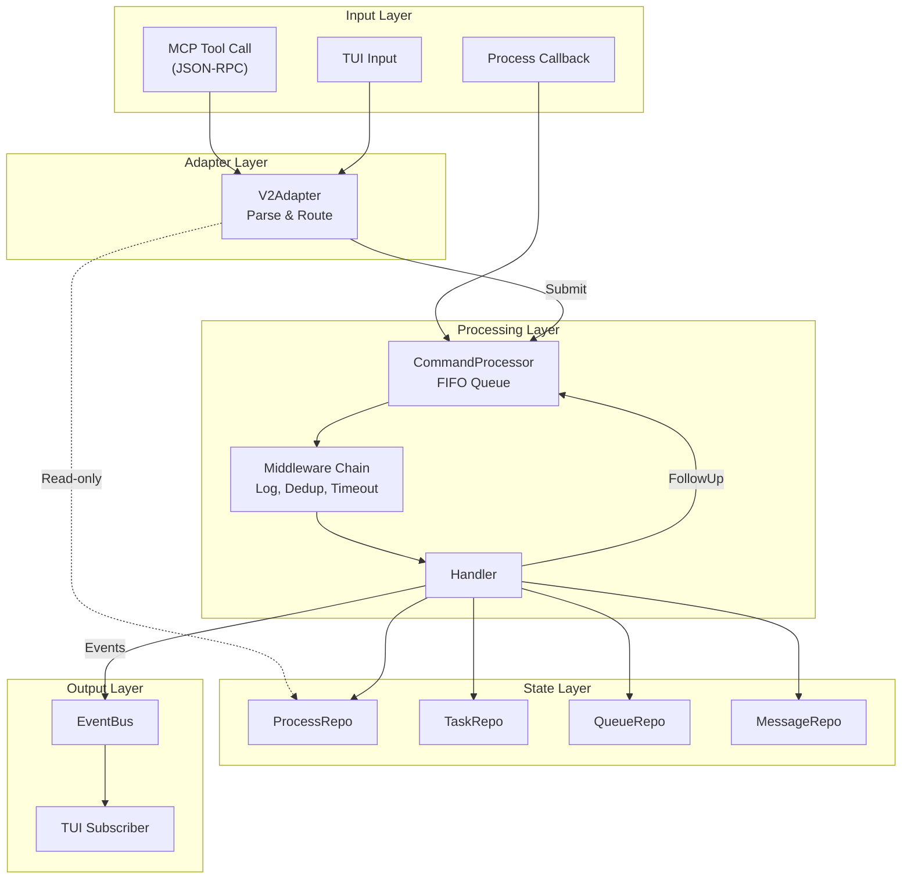

## Command Processing Pipeline

### FIFO Processor Architecture

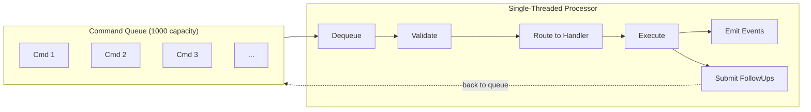

### Execution Pipeline Detail

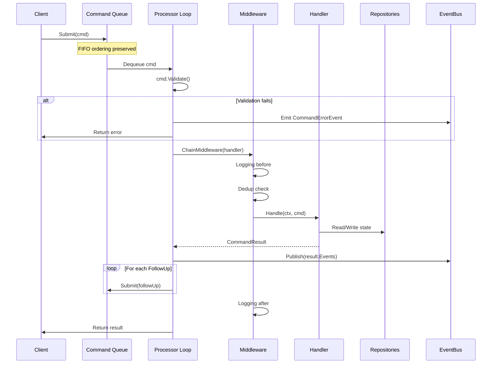

## Read vs Write Path (CQRS)

The v2 system separates read and write operations for performance:

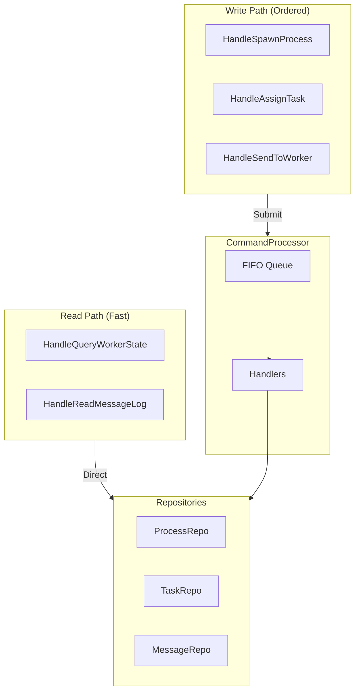

**Rationale:**
- Reads don't mutate state → no ordering needed
- Writes must be serialized → FIFO queue guarantees consistency
- Read latency is critical for UI responsiveness

## Message Queue Pattern

The system uses a **queue-or-deliver** pattern for worker messages:

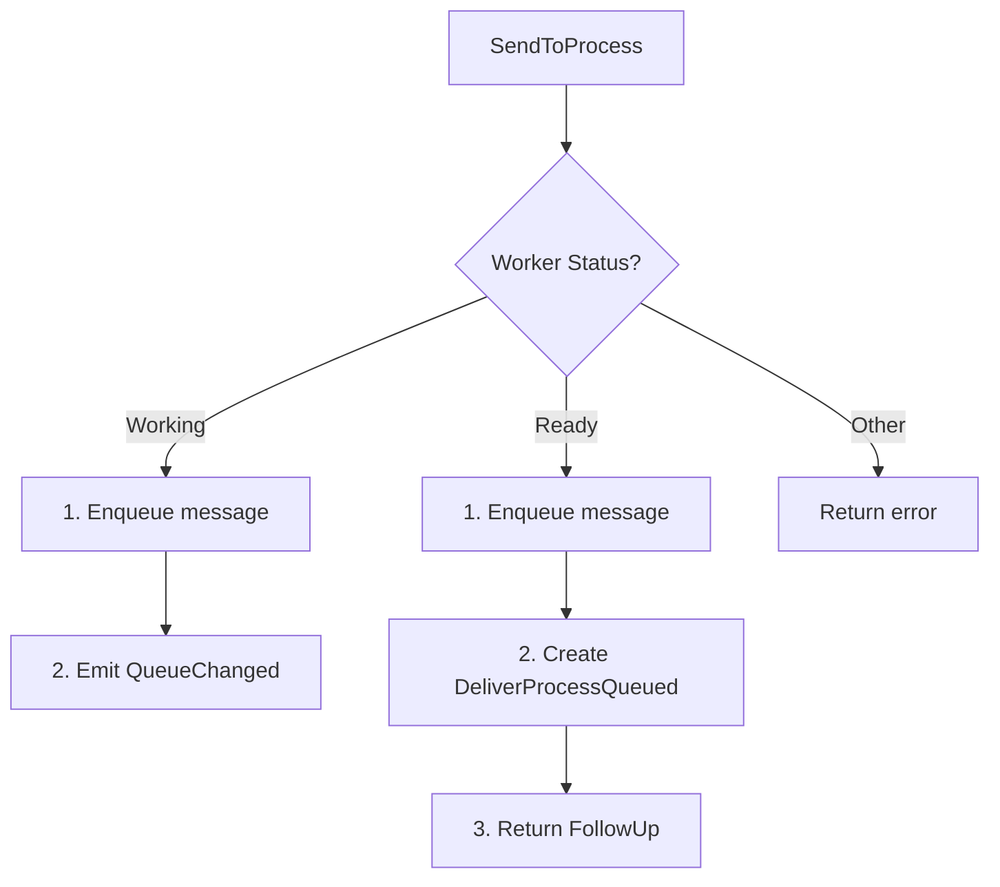

### Queue Drain on Turn Complete

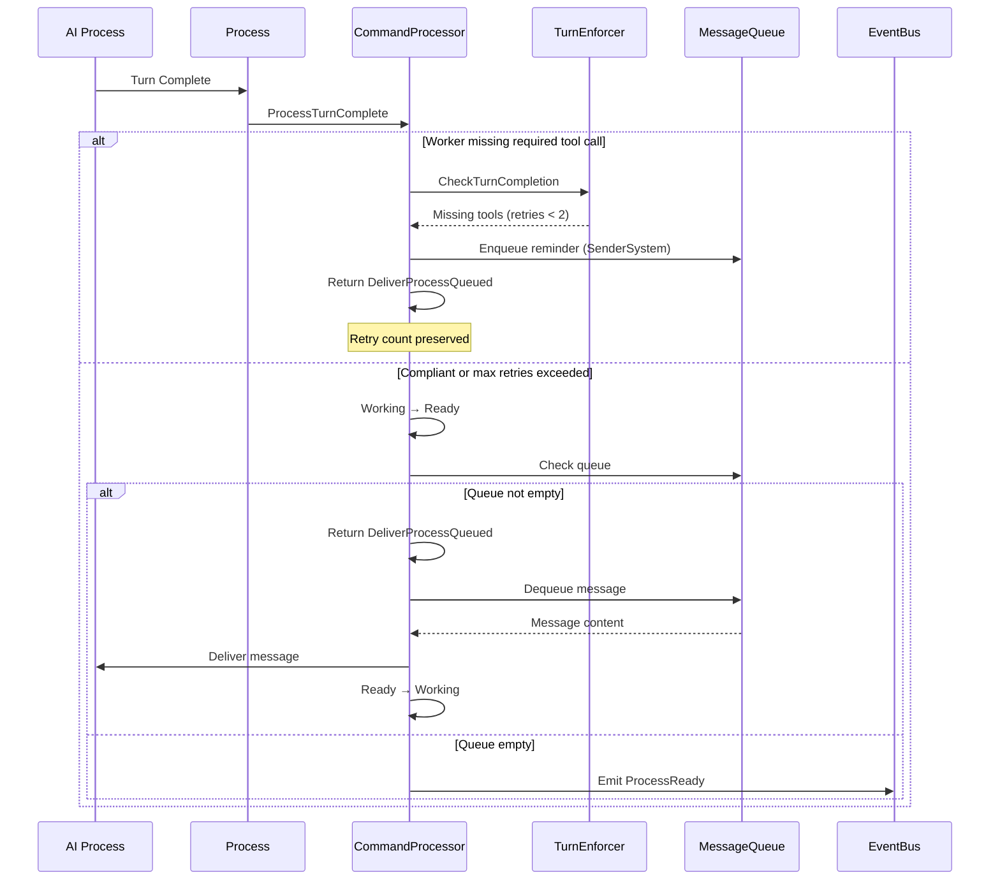

## Event Emission and Subscription

### Event Types

```mermaid
flowchart LR
    subgraph Sources["Event Sources"]
        H["Handlers"]
        P["Process Event Loop"]
        E["Error Handler"]
    end
    
    subgraph Events["Event Types"]
        PS["ProcessSpawned"]
        PO["ProcessOutput"]
        PSC["ProcessStatusChange"]
        PTU["ProcessTokenUsage"]
        PE["ProcessError"]
        PQC["ProcessQueueChanged"]
        PR["ProcessReady"]
        PW["ProcessWorking"]
    end
    
    subgraph Bus["EventBus"]
        EB["pubsub.Broker[any]"]
    end
    
    subgraph Subs["Subscribers"]
        TUI["TUI"]
        LOG["Logger"]
        MET["Metrics"]
    end
    
    Sources --> Events
    Events --> EB
    EB --> Subs
```

### Pub/Sub Pattern

```go
// Subscribe with context for auto-cleanup
eventCh := eventBus.Subscribe(ctx)

// Non-blocking publish
eventBus.Publish(pubsub.UpdatedEvent, processEvent)

// Receive in goroutine
for evt := range eventCh {
    switch e := evt.Payload.(type) {
    case events.ProcessEvent:
        // Handle process event
    case processor.CommandErrorEvent:
        // Handle command error
    }
}
```

### ContinuousListener (Bubble Tea)

For TUI integration, use `ContinuousListener` to maintain subscription across the update loop:

```go
type Model struct {
    listener *pubsub.ContinuousListener[any]
}

func (m Model) Update(msg tea.Msg) (Model, tea.Cmd) {
    switch msg := msg.(type) {
    case pubsub.Event[any]:
        // Handle event
        return m, m.listener.Listen()  // Always continue listening!
    }
    return m, nil
}
```

## Complete Example: Task Assignment Flow

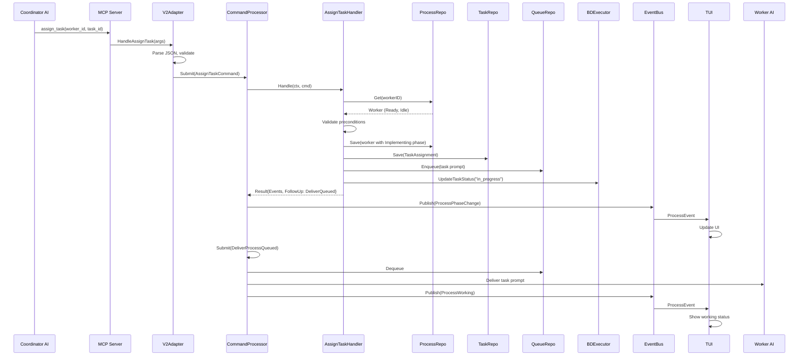

## Error Handling Flow

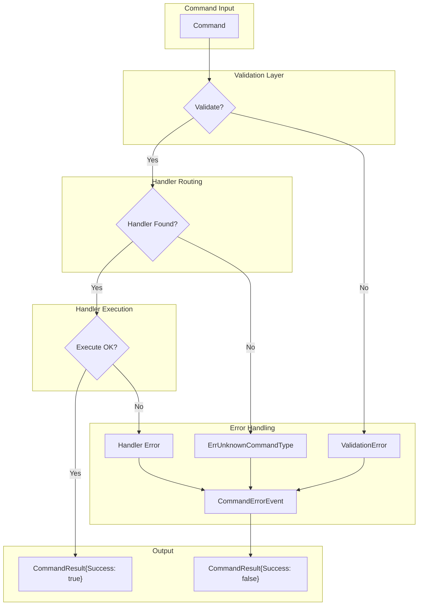

## Middleware Chain

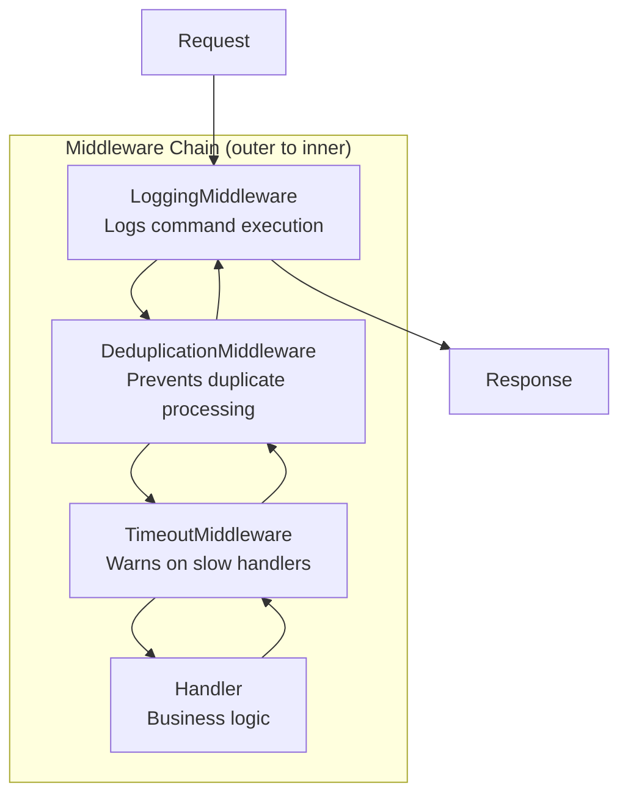

### Deduplication

```go
// SHA256 hash of command content (excludes ID, timestamp)
func computeContentHash(cmd Command) string {
    // Hash type + type-specific fields
    // Commands can implement ContentHash() for custom logic
}

// Cache with TTL (default 5s)
type DeduplicationMiddleware struct {
    cache sync.Map       // contentHash → expiry
    ttl   time.Duration  // 5 seconds
}
```

## Message Repository Integration

The MessageRepository provides an inter-agent communication log:

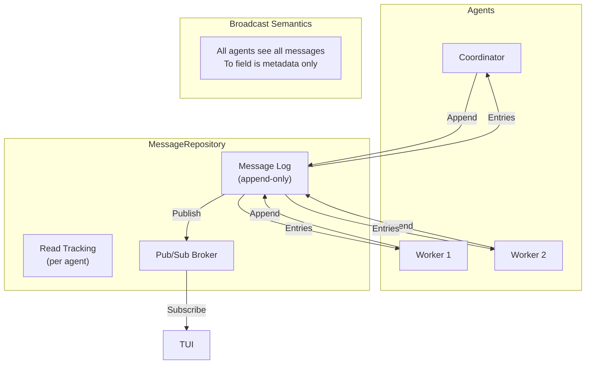

### Message Entry

```go
type Message struct {
    ID        string
    Timestamp time.Time
    From      string      // COORDINATOR, WORKER.1, USER
    To        string      // ALL, COORDINATOR, WORKER.2
    Content   string
    Type      MessageType // info, request, response, completion, error
    ReadBy    []string    // Track which agents have read
}
```
