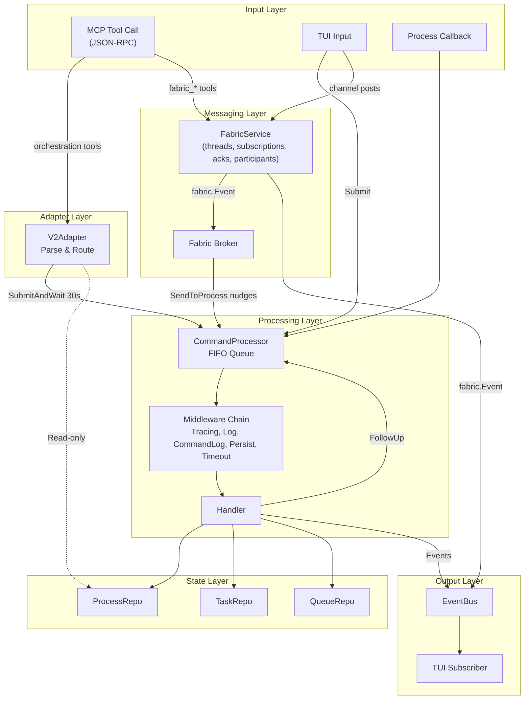
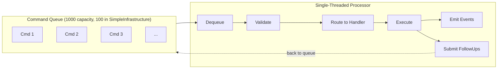
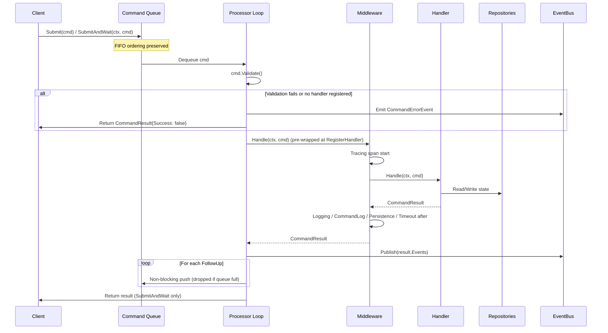
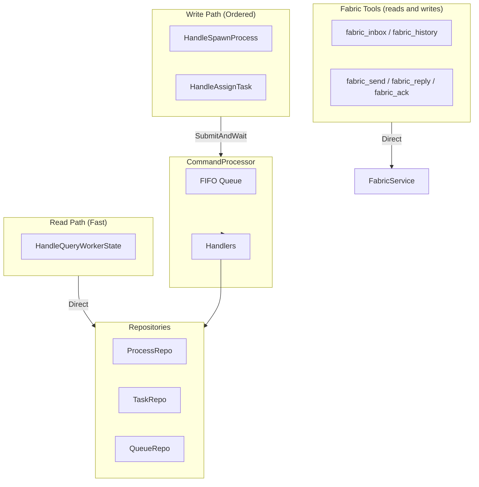
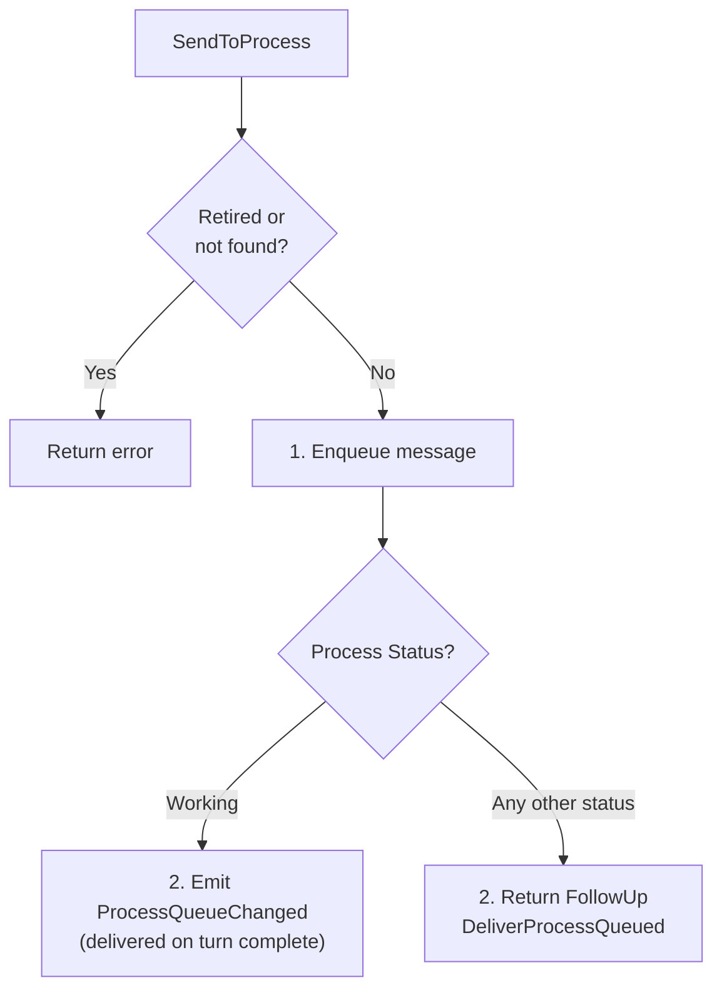
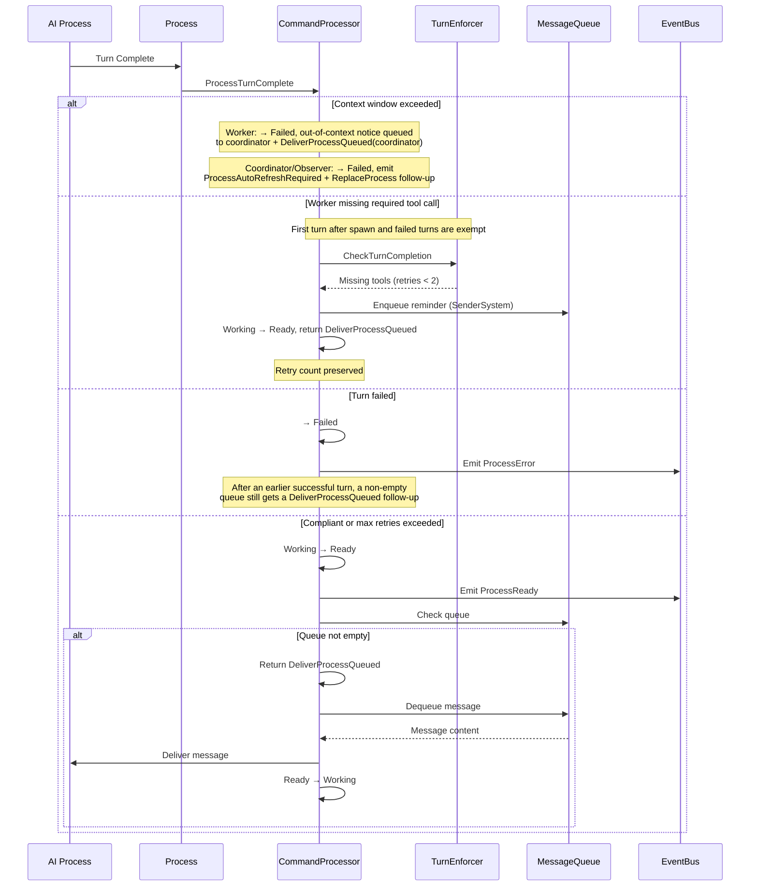
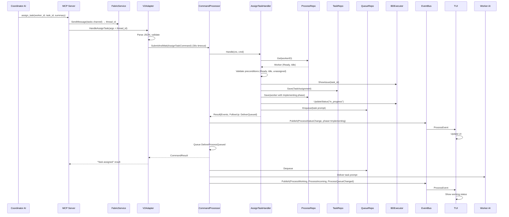
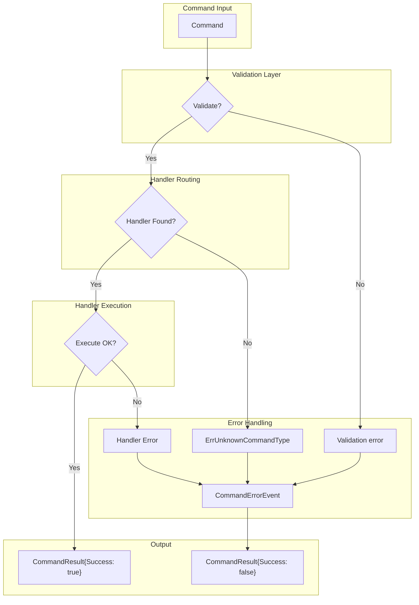
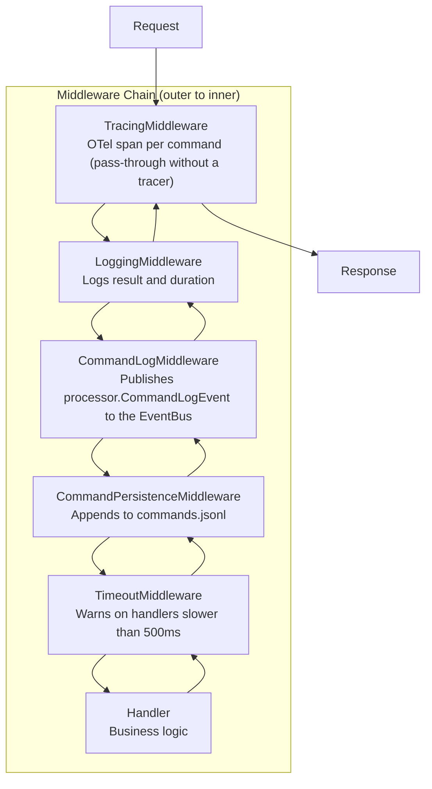
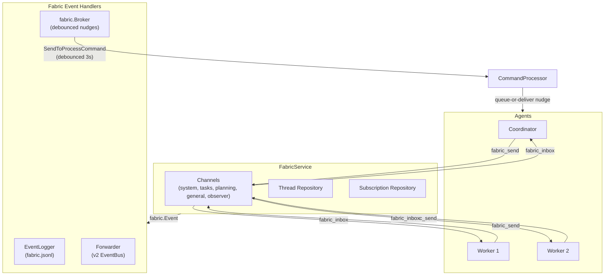

# Message Flow and Processing Pipeline

This document describes the end-to-end message flow in the v2 orchestration system, from MCP tool calls through command processing to UI updates.

## High-Level Flow


```mermaid
flowchart TB
    subgraph Input["Input Layer"]
        MCP["MCP Tool Call<br/>(JSON-RPC)"]
        User["TUI Input"]
        Callback["Process Callback"]
    end
    
    subgraph Adapter["Adapter Layer"]
        V2A["V2Adapter<br/>Parse & Route"]
    end
    
    subgraph Processing["Processing Layer"]
        CP["CommandProcessor<br/>FIFO Queue"]
        MW["Middleware Chain<br/>Tracing, Log, CommandLog, Persist, Timeout"]
        HR["Handler"]
    end
    
    subgraph State["State Layer"]
        PR["ProcessRepo"]
        TR["TaskRepo"]
        QR["QueueRepo"]
    end
    
    subgraph Messaging["Messaging Layer"]
        FS["FabricService<br/>(threads, subscriptions, acks, participants)"]
        FB["Fabric Broker"]
    end
    
    subgraph Output["Output Layer"]
        EB["EventBus"]
        TUI["TUI Subscriber"]
    end
    
    MCP -->|orchestration tools| V2A
    MCP -->|fabric_* tools| FS
    User -->|Submit| CP
    User -->|channel posts| FS
    Callback --> CP
    
    V2A -->|SubmitAndWait 30s| CP
    V2A -.->|Read-only| PR
    
    CP --> MW
    MW --> HR
    HR --> PR
    HR --> TR
    HR --> QR
    HR -->|Events| EB
    HR -->|FollowUp| CP
    
    FS -->|fabric.Event| FB
    FS -->|fabric.Event| EB
    FB -->|SendToProcess nudges| CP
    
    EB --> TUI
```

Only MCP tool calls go through `V2Adapter`, which uses `SubmitAndWait` with a 30s timeout (`stop_worker` is the one fire-and-forget `Submit`). TUI input submits v2 commands directly: the dashboard coordinator panel through `Infrastructure.Core.CmdSubmitter`, and the chat panel through `SimpleInfrastructure.Submit`. The dashboard also posts channel messages and replies straight to `fabric.Service` as `user`. The control plane uses `Processor.SubmitAndWait`. Fabric messages bypass the v2 repositories entirely and live in `fabric.Service`.

## Command Processing Pipeline

### FIFO Processor Architecture


```mermaid
flowchart LR
    subgraph Queue["Command Queue (1000 capacity, 100 in SimpleInfrastructure)"]
        Q1["Cmd 1"]
        Q2["Cmd 2"]
        Q3["Cmd 3"]
        QN["..."]
    end
    
    subgraph Processor["Single-Threaded Processor"]
        Dequeue["Dequeue"]
        Validate["Validate"]
        Route["Route to Handler"]
        Execute["Execute"]
        Emit["Emit Events"]
        FollowUp["Submit FollowUps"]
    end
    
    Queue --> Dequeue
    Dequeue --> Validate
    Validate --> Route
    Route --> Execute
    Execute --> Emit
    Execute --> FollowUp
    FollowUp -.->|back to queue| Queue
```

### Execution Pipeline Detail


```mermaid
sequenceDiagram
    participant Client
    participant Queue as Command Queue
    participant Proc as Processor Loop
    participant MW as Middleware
    participant Handler
    participant Repo as Repositories
    participant EB as EventBus
    
    Client->>Queue: Submit(cmd) / SubmitAndWait(ctx, cmd)
    Note over Queue: FIFO ordering preserved
    
    Queue->>Proc: Dequeue cmd
    Proc->>Proc: cmd.Validate()
    alt Validation fails or no handler registered
        Proc->>EB: Emit CommandErrorEvent
        Proc->>Client: Return CommandResult{Success: false}
    end
    
    Proc->>MW: Handle(ctx, cmd) (pre-wrapped at RegisterHandler)
    MW->>MW: Tracing span start
    MW->>Handler: Handle(ctx, cmd)
    
    Handler->>Repo: Read/Write state
    Handler-->>MW: CommandResult
    MW->>MW: Logging / CommandLog / Persistence / Timeout after
    MW-->>Proc: CommandResult
    
    Proc->>EB: Publish(result.Events)
    
    loop For each FollowUp
        Proc->>Queue: Non-blocking push (dropped if queue full)
    end
    
    Proc->>Client: Return result (SubmitAndWait only)
```

`RegisterHandler` wraps each handler with the middleware chain once, at registration time. All middleware after-logic finishes before `result.Events` are published and follow-ups are queued.

## Read vs Write Path (CQRS)

The v2 system separates read and write operations for performance:


```mermaid
flowchart TB
    subgraph Reads["Read Path (Fast)"]
        R1["HandleQueryWorkerState"]
    end
    
    subgraph Writes["Write Path (Ordered)"]
        W1["HandleSpawnProcess"]
        W2["HandleAssignTask"]
    end
    
    subgraph FabricTools["Fabric Tools (reads and writes)"]
        F1["fabric_inbox / fabric_history"]
        F2["fabric_send / fabric_reply / fabric_ack"]
    end
    
    subgraph Repos["Repositories"]
        PR["ProcessRepo"]
        TR["TaskRepo"]
        QR["QueueRepo"]
    end
    
    subgraph CP["CommandProcessor"]
        Queue["FIFO Queue"]
        Handler["Handlers"]
    end
    
    FS["FabricService"]
    
    Reads -->|Direct| Repos
    Writes -->|SubmitAndWait| CP
    CP --> Handler
    Handler --> Repos
    FabricTools -->|Direct| FS
```

**Rationale:**
- Reads don't mutate state → no ordering needed
- Writes to v2 process and task state must be serialized → FIFO queue guarantees consistency
- Reads don't wait behind queued commands, so `query_worker_state` answers immediately

Fabric messaging (reads and writes) goes directly to `fabric.Service` and does not pass through the FIFO CommandProcessor. Fabric only re-enters the processor through the Broker's SendToProcess nudges (see [Fabric Messaging Integration](#fabric-messaging-integration)).

## Message Queue Pattern

The system uses a **queue-or-deliver** pattern for messages to any process (coordinator and workers use the same logic):


```mermaid
flowchart TD
    Send["SendToProcess"]
    
    Send --> Check{Retired or<br/>not found?}
    Check -->|Yes| Error["Return error"]
    Check -->|No| Enqueue["1. Enqueue message"]
    
    Enqueue --> GetStatus{Process Status?}
    
    GetStatus -->|Working| EmitQueue["2. Emit ProcessQueueChanged<br/>(delivered on turn complete)"]
    GetStatus -->|Any other status| CreateFollowUp["2. Return FollowUp<br/>DeliverProcessQueued"]
```

The queued message's sender comes from the command source: MCP tool calls are `coordinator`, internal commands (Fabric nudges, broadcasts) are `system`, and anything else is `user`. Turn-enforcement reminders and worker out-of-context notices skip SendToProcess and are enqueued directly as `system`. `BroadcastCommand` (registered in `NewInfrastructure` only, not `SimpleInfrastructure`) fans out one SendToProcess follow-up to each worker that is not retired, failed, or excluded.

### Queue Drain on Turn Complete


```mermaid
sequenceDiagram
    participant AI as AI Process
    participant Proc as Process
    participant CP as CommandProcessor
    participant TE as TurnEnforcer
    participant Queue as MessageQueue
    participant EB as EventBus
    
    AI->>Proc: Turn Complete
    Proc->>CP: ProcessTurnComplete
    
    alt Context window exceeded
        Note over CP: Worker: → Failed, out-of-context notice queued<br/>to coordinator + DeliverProcessQueued(coordinator)
        Note over CP: Coordinator/Observer: → Failed, emit<br/>ProcessAutoRefreshRequired + ReplaceProcess follow-up
    else Worker missing required tool call
        Note over CP,TE: First turn after spawn and failed turns are exempt
        CP->>TE: CheckTurnCompletion
        TE-->>CP: Missing tools (retries < 2)
        CP->>Queue: Enqueue reminder (SenderSystem)
        CP->>CP: Working → Ready, return DeliverProcessQueued
        Note over CP: Retry count preserved
    else Turn failed
        CP->>CP: → Failed
        CP->>EB: Emit ProcessError
        Note over CP: After an earlier successful turn, a non-empty<br/>queue still gets a DeliverProcessQueued follow-up
    else Compliant or max retries exceeded
        CP->>CP: Working → Ready
        CP->>EB: Emit ProcessReady
        CP->>Queue: Check queue
        
        alt Queue not empty
            CP->>CP: Return DeliverProcessQueued
            CP->>Queue: Dequeue message
            Queue-->>CP: Message content
            CP->>AI: Deliver message
            CP->>CP: Ready → Working
        end
    end
```

## Event Emission and Subscription

### Event Types


```mermaid
flowchart LR
    subgraph Sources["Event Sources"]
        H["Handlers"]
        P["Process Event Loop"]
        E["Processor errors"]
        M["CommandLogMiddleware"]
        F["Fabric forwarder"]
    end
    
    subgraph Events["ProcessEvent Types"]
        PS["ProcessSpawned"]
        PO["ProcessOutput"]
        PSC["ProcessStatusChange"]
        PTU["ProcessTokenUsage"]
        PI["ProcessIncoming"]
        PE["ProcessError"]
        PQC["ProcessQueueChanged"]
        PR["ProcessReady"]
        PW["ProcessWorking"]
        PWC["ProcessWorkflowComplete"]
        PAR["ProcessAutoRefreshRequired"]
        PUN["ProcessUserNotification"]
    end
    
    subgraph Other["Other Payloads"]
        CLE["processor.CommandLogEvent"]
        CEE["processor.CommandErrorEvent"]
        FE["fabric.Event"]
    end
    
    subgraph Bus["EventBus"]
        EB["pubsub.Broker[any]"]
    end
    
    subgraph Subs["Subscribers"]
        TUI["Chat panel TUI<br/>(SimpleInfrastructure)"]
        LOG["Session logger"]
        CPF["ControlPlane forwarder<br/>(dashboard, HealthMonitor, SSE)"]
    end
    
    Sources --> Events
    Sources --> Other
    Events --> EB
    Other --> EB
    EB --> Subs
```

### Pub/Sub Pattern

```go
// Subscribe with context for auto-cleanup
eventCh := eventBus.Subscribe(ctx)

// Non-blocking publish
eventBus.Publish(pubsub.UpdatedEvent, processEvent)

// Receive in goroutine
for evt := range eventCh {
    switch e := evt.Payload.(type) {
    case events.ProcessEvent:
        // Handle process event
    case processor.CommandLogEvent:
        // Every command that reached its handler (published by CommandLogMiddleware)
    case processor.CommandErrorEvent:
        // Validation, routing, or handler error
    case fabric.Event:
        // Fabric activity (forwarded by the control-plane supervisor)
    }
}
```

### ContinuousListener (Bubble Tea)

For TUI integration, use `ContinuousListener` to maintain subscription across the update loop:

```go
type Model struct {
    listener *pubsub.ContinuousListener[any]
}

func (m Model) Update(msg tea.Msg) (Model, tea.Cmd) {
    switch msg := msg.(type) {
    case pubsub.Event[any]:
        // Handle event
        return m, m.listener.Listen()  // Always continue listening!
    }
    return m, nil
}
```

## Complete Example: Task Assignment Flow


```mermaid
sequenceDiagram
    participant Coord as Coordinator AI
    participant MCP as MCP Server
    participant Fabric as FabricService
    participant V2A as V2Adapter
    participant CP as CommandProcessor
    participant ATH as AssignTaskHandler
    participant PR as ProcessRepo
    participant TR as TaskRepo
    participant QR as QueueRepo
    participant BD as BDExecutor
    participant EB as EventBus
    participant TUI as TUI
    participant W1 as Worker AI
    
    Coord->>MCP: assign_task(worker_id, task_id, summary)
    MCP->>Fabric: SendMessage(tasks channel) → thread_id
    MCP->>V2A: HandleAssignTask(args + thread_id)
    V2A->>V2A: Parse JSON, validate
    V2A->>CP: SubmitAndWait(AssignTaskCommand) (30s timeout)
    
    CP->>ATH: Handle(ctx, cmd)
    
    ATH->>PR: Get(workerID)
    PR-->>ATH: Worker (Ready, Idle)
    
    ATH->>ATH: Validate preconditions (Ready, Idle, unassigned)
    ATH->>BD: ShowIssue(task_id)
    ATH->>TR: Save(TaskAssignment)
    ATH->>PR: Save(worker with Implementing phase)
    ATH->>BD: UpdateStatus("in_progress")
    ATH->>QR: Enqueue(task prompt)
    
    ATH-->>CP: Result{Events, FollowUp: DeliverQueued}
    
    CP->>EB: Publish(ProcessStatusChange, phase=Implementing)
    EB->>TUI: ProcessEvent
    TUI->>TUI: Update UI
    
    CP->>CP: Queue DeliverProcessQueued
    CP-->>V2A: CommandResult
    V2A-->>MCP: "Task assigned" result
    
    CP->>QR: Dequeue
    CP->>W1: Deliver task prompt
    
    CP->>EB: Publish(ProcessWorking, ProcessIncoming, ProcessQueueChanged)
    EB->>TUI: ProcessEvent
    TUI->>TUI: Show working status
```

If the `#tasks` post fails, the assignment still proceeds without a thread ID. The post has no @mention: the worker is notified by the v2 delivery, not by the Fabric Broker.

## Error Handling Flow


```mermaid
flowchart TD
    subgraph Input["Command Input"]
        Cmd["Command"]
    end
    
    subgraph Validation["Validation Layer"]
        Val{Validate?}
    end
    
    subgraph Routing["Handler Routing"]
        Route{Handler Found?}
    end
    
    subgraph Execution["Handler Execution"]
        Exec{Execute OK?}
    end
    
    subgraph Errors["Error Handling"]
        ValErr["Validation error"]
        RouteErr["ErrUnknownCommandType"]
        ExecErr["Handler Error"]
        ErrEvt["CommandErrorEvent"]
    end
    
    subgraph Output["Output"]
        Success["CommandResult{Success: true}"]
        Failure["CommandResult{Success: false}"]
    end
    
    Cmd --> Val
    Val -->|Yes| Route
    Val -->|No| ValErr
    
    Route -->|Yes| Exec
    Route -->|No| RouteErr
    
    Exec -->|Yes| Success
    Exec -->|No| ExecErr
    
    ValErr --> ErrEvt
    RouteErr --> ErrEvt
    ExecErr --> ErrEvt
    
    ErrEvt --> Failure
```

When a handler returns an error, the processor replaces its result with `CommandResult{Success: false}` and drops any events and follow-ups. A handler that returns `CommandResult{Success: false}` without an error skips `CommandErrorEvent`, but its events and follow-ups still go out. Validation and routing failures never reach the middleware, so they produce no `CommandLogEvent` or `commands.jsonl` entry.

## Middleware Chain


```mermaid
flowchart TB
    subgraph Chain["Middleware Chain (outer to inner)"]
        TR["TracingMiddleware<br/>OTel span per command (pass-through without a tracer)"]
        L["LoggingMiddleware<br/>Logs result and duration"]
        CL["CommandLogMiddleware<br/>Publishes processor.CommandLogEvent to the EventBus"]
        CPM["CommandPersistenceMiddleware<br/>Appends to commands.jsonl"]
        T["TimeoutMiddleware<br/>Warns on handlers slower than 500ms"]
        H["Handler<br/>Business logic"]
    end
    
    Request --> TR
    TR --> L
    L --> CL
    CL --> CPM
    CPM --> T
    T --> H
    H --> T
    T --> CPM
    CPM --> CL
    CL --> L
    L --> TR
    TR --> Response
```

This is the chain `NewInfrastructure` builds (every dashboard and daemon workflow). The tracer is set only when `orchestration.tracing.enabled` is true. `SimpleInfrastructure` (the Kanban/Search chat panel) uses Logging → CommandLog → Timeout. None of these middlewares abort a slow handler.

### Deduplication (available, not enabled)

`processor.DeduplicationMiddleware` is implemented but is not wired into `NewInfrastructure` or `SimpleInfrastructure`, so duplicate commands are currently not suppressed. If added via `NewDeduplicationMiddleware(cfg).Middleware()`, a command whose content hash was seen within the TTL returns `CommandResult{Success: false, Error: ErrDuplicateCommand}`.

```go
// SHA256 hash of command type + content (excludes ID, timestamp)
func (m *DeduplicationMiddleware) computeContentHash(cmd command.Command) string {
    // Hash type + type-specific fields
    // Commands can implement ContentHash() for custom logic
}

// Cache with TTL (DefaultDeduplicationTTL = 5s)
type DeduplicationMiddleware struct {
    cache sync.Map       // contentHash → expiry
    ttl   time.Duration  // 5 seconds by default
    // ...
}
```

## Fabric Messaging Integration

Inter-agent communication uses the Fabric messaging layer, which provides Slack-like channels and threads:


```mermaid
flowchart TB
    subgraph Agents["Agents"]
        Coord["Coordinator"]
        W1["Worker 1"]
        W2["Worker 2"]
    end
    
    subgraph Fabric["FabricService"]
        Channels["Channels<br/>(system, tasks, planning, general, observer)"]
        Threads["Thread Repository"]
        Subs["Subscription Repository"]
    end
    
    subgraph Handlers["Fabric Event Handlers"]
        Persist["EventLogger<br/>(fabric.jsonl)"]
        Broker["fabric.Broker<br/>(debounced nudges)"]
        Fwd["Forwarder<br/>(v2 EventBus)"]
    end
    
    CP["CommandProcessor"]
    
    Coord -->|fabric_send| Channels
    W1 -->|fabric_send| Channels
    W2 -->|fabric_send| Channels
    
    Channels -->|fabric_inbox| Coord
    Channels -->|fabric_inbox| W1
    Channels -->|fabric_inbox| W2
    
    Fabric -->|fabric.Event| Handlers
    Broker -->|"SendToProcessCommand<br/>(debounced 3s)"| CP
    CP -->|queue-or-deliver nudge| Agents
```

The control-plane supervisor fans every `fabric.Event` out to three handlers: fabric.jsonl persistence, the Broker, and the workflow's v2 EventBus (which is how the dashboard sees Fabric activity). The Broker reacts only to posted messages and replies. It nudges:

- subscribers in `all` mode
- @mentioned agents, whether or not they are subscribed
- every joined participant for `@here`
- participants of the parent thread, for replies

The sender and `user` are never nudged, and activity in `#observer` only nudges the observer. Pending nudges are batched per agent behind a single 3s debounce timer that restarts on each new notification. On flush, each agent gets one `SendToProcessCommand` (source internal, so the sender is `system`) reading `[<sender> sent a message in #<channel>] Use fabric_inbox to check messages.` (or `[<a>, <b> sent messages in #<channel>] ...` for several senders), which follows the [queue-or-deliver pattern](#message-queue-pattern) above.

Fabric tools available to agents:

| Tool | Purpose |
|------|---------|
| `fabric_join` | Register as a participant (receives `@here`) and post a join message to `#system` |
| `fabric_inbox` | Read unread messages for the agent |
| `fabric_send` | Post a message to a channel, with optional @mentions |
| `fabric_reply` | Reply in a message thread |
| `fabric_ack` | Mark messages as read |
| `fabric_subscribe` | Subscribe to a channel (`all`, `mentions`, or `none`) |
| `fabric_unsubscribe` | Unsubscribe from a channel |
| `fabric_attach` | Attach a file (referenced, not copied) to a message or channel |
| `fabric_history` | View channel history |
| `fabric_read_thread` | Read a thread with its replies and artifacts |
| `fabric_react` | Add or remove an emoji reaction |

Workers get all 11 tools. The coordinator gets all except `fabric_join`. The observer gets all except `fabric_join` and `fabric_unsubscribe`, and its `fabric_send` / `fabric_reply` are limited to `#observer`. For workers, `fabric_send`, `fabric_reply`, `fabric_ack` and `fabric_join` (along with `report_implementation_complete` and `report_review_verdict`) satisfy turn-completion enforcement.
