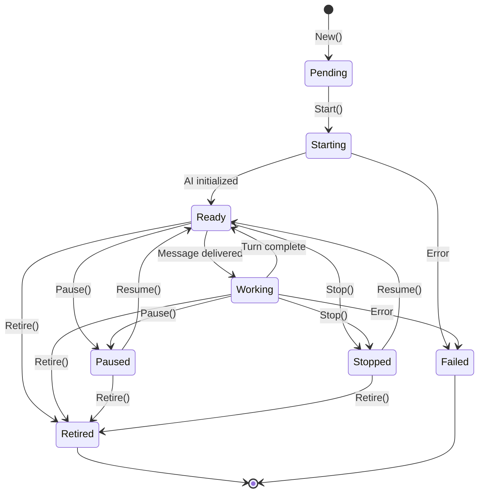
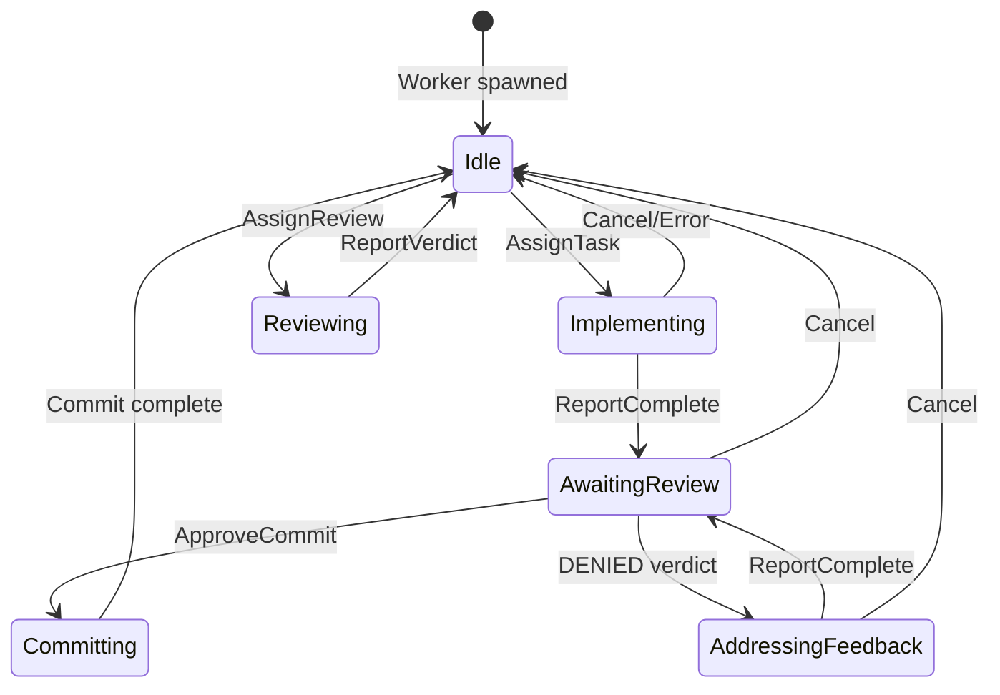
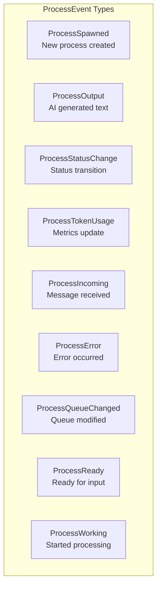
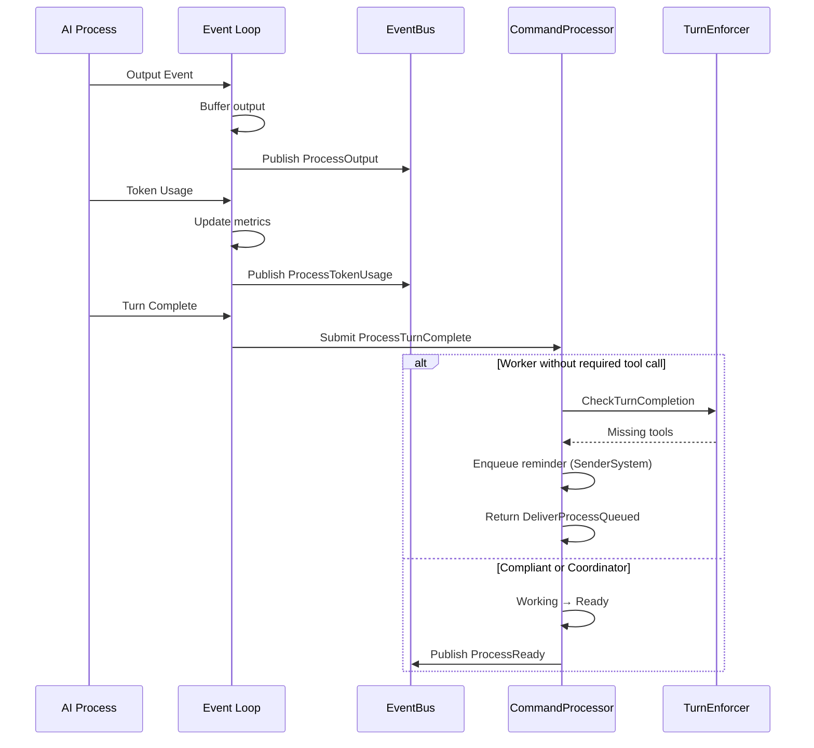
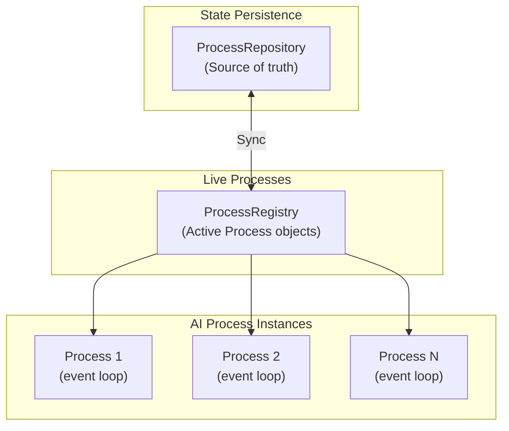
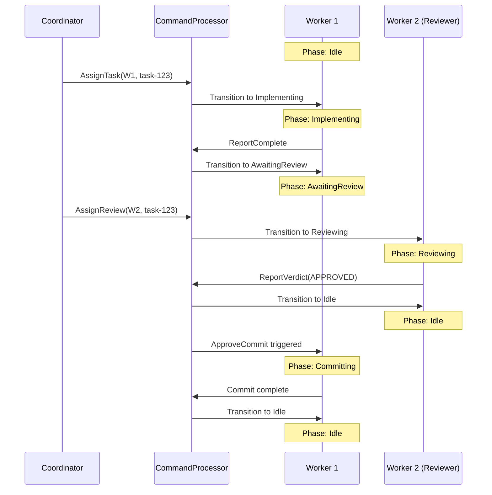

# Process Lifecycle and State Management

This document describes the lifecycle of processes (coordinator and workers) in the v2 orchestration system, including status transitions, worker phases, and event emission.

## Process Types

The v2 system manages two types of processes:

| Type | Count | Purpose |
|------|-------|---------|
| **Coordinator** | 1 (singleton) | Orchestrates work, doesn't write code |
| **Worker** | 1-N | Executes tasks, writes code, performs reviews |

Both types use the same `Process` struct with role-based differentiation.

## Process Status State Machine



### Status Definitions

| Status | Description | Terminal? |
|--------|-------------|-----------|
| `Pending` | Process created but not started | No |
| `Starting` | AI process initializing | No |
| `Ready` | Idle, waiting for input | No |
| `Working` | Actively processing AI turn | No |
| `Paused` | Temporarily suspended by user | No |
| `Stopped` | Stopped by user, can be resumed | No |
| `Retired` | Gracefully shut down | Yes |
| `Failed` | Encountered unrecoverable error | Yes |

## Worker Phase State Machine

Workers have an additional **phase** layer that tracks their task workflow state:



### Phase Definitions

| Phase | Description | Valid Transitions To |
|-------|-------------|---------------------|
| `Idle` | Ready for task assignment | Implementing, Reviewing |
| `Implementing` | Actively coding a task | AwaitingReview, Idle |
| `AwaitingReview` | Code complete, waiting for review | Committing, AddressingFeedback, Idle |
| `Reviewing` | Reviewing another worker's code | Idle |
| `AddressingFeedback` | Fixing review issues | AwaitingReview, Idle |
| `Committing` | Creating git commit | Idle |

### Phase Transition Validation

```go
var ValidTransitions = map[ProcessPhase][]ProcessPhase{
    Idle:               {Implementing, Reviewing},
    Implementing:       {AwaitingReview, Idle},
    AwaitingReview:     {Committing, AddressingFeedback, Idle},
    Reviewing:          {Idle},
    AddressingFeedback: {AwaitingReview, Idle},
    Committing:         {Idle},
}
```

## Process Struct

```go
type Process struct {
    ID             string              // "coordinator", "worker-1", etc.
    Role           ProcessRole         // RoleCoordinator or RoleWorker
    Status         ProcessStatus       // Current lifecycle status
    SessionID      string              // Claude/Amp session ID
    Metrics        *TokenMetrics       // Token usage and costs
    CreatedAt      time.Time
    LastActivityAt time.Time
    Phase          *ProcessPhase       // Worker-only: task phase
    TaskID         string              // Worker-only: current task
    RetiredAt      time.Time           // Zero if active
}
```

## Event Types

The system emits events for all significant process state changes:



### ProcessEvent Structure

```go
type ProcessEvent struct {
    Type       ProcessEventType    // Event type enum
    ProcessID  string              // Which process
    Role       ProcessRole         // Coordinator or Worker
    Output     string              // For output events
    Status     ProcessStatus       // For status changes
    Phase      *ProcessPhase       // Worker phase (if applicable)
    TaskID     string              // Worker task (if applicable)
    Metrics    *TokenMetrics       // For token usage events
    Message    string              // For incoming events
    Error      error               // For error events
    RawJSON    []byte              // Raw API response
    QueueCount int                 // Pending queue messages
}
```

## Process Event Loop

Each process runs an event loop that handles AI process events:



### Event Loop Implementation

```go
func (p *Process) eventLoop() {
    defer close(p.eventDone)
    
    for {
        select {
        case <-p.ctx.Done():
            return
            
        case event, ok := <-procEvents:
            if !ok {
                p.handleProcessComplete()
                return
            }
            p.handleOutputEvent(&event)
            
        case err, ok := <-procErrors:
            if !ok { continue }
            p.handleError(err)
        }
    }
}
```

## Turn Completion Enforcement

Workers are required to call specific MCP tools to properly complete their turn. This ensures workers always communicate their state back to the coordinator.

### Required Tools

| Tool | Purpose |
|------|---------|
| `post_message` | General communication with coordinator |
| `report_implementation_complete` | Report task implementation done |
| `report_review_verdict` | Report code review result |
| `signal_ready` | Signal worker is ready (after startup) |

### Enforcement Mechanism

The `TurnCompletionEnforcer` tracks tool calls during each turn:

```go
type TurnCompletionEnforcer interface {
    RecordToolCall(processID, toolName string)   // Called from MCP handlers
    ResetTurn(processID string)                  // Clear state for new turn
    CheckTurnCompletion(id, role) []string       // Returns missing tools
    ShouldRetry(processID string) bool           // Check retry limit
    IncrementRetry(processID string)             // Increment retry count
}
```

### Enforcement Flow

1. **Turn completes** without required tool call
2. **Check exemptions**: Failed turns and newly spawned workers are exempt
3. **Retry check**: If retries < 2, enqueue system reminder
4. **Delivery**: Reminder delivered via `DeliverProcessQueuedHandler`
5. **Preserve state**: `SenderSystem` messages don't reset retry count
6. **Max exceeded**: After 2 retries, allow turn to complete (log warning)

### Sender Types

| Type | Description | Resets Turn? |
|------|-------------|--------------|
| `SenderUser` | Message from TUI user | Yes |
| `SenderCoordinator` | Message from coordinator | Yes |
| `SenderSystem` | Enforcement reminder | No |

## Output Buffer

Each process maintains a ring buffer for recent output:

```go
type OutputBuffer struct {
    lines    []string  // Fixed-size array (default 100)
    capacity int
    start    int       // Index of oldest line
    count    int       // Lines stored
}
```

**Methods:**
- `Append(line)` - Add line, evict oldest if full
- `Lines()` - All lines chronologically (copy)
- `Last(n)` - Last n lines
- `Clear()` - Empty buffer

## Process Registry

The `ProcessRegistry` tracks live `Process` instances for runtime operations:



**Registry Methods:**
```go
Register(p *Process)         // Add/replace process
Unregister(id string)        // Remove process
Get(id string) *Process      // Get by ID
GetCoordinator() *Process    // Get coordinator
Workers() []*Process         // All workers (copy)
ActiveCount() int            // Non-retired workers
ResumeProcess(id, proc)      // Resume with new AI process
```

## Token Metrics

Each process tracks token usage across turns:

```go
type TokenMetrics struct {
    InputTokens              int
    CacheReadInputTokens     int
    CacheCreationInputTokens int
    OutputTokens             int
    ContextTokens            int       // Current context window usage
    ContextWindow            int       // Max context size
    TurnCostUSD              float64   // This turn's cost
    TotalCostUSD             float64   // Session total
    CumulativeCostUSD        float64   // Running total across turns
    LastUpdatedAt            time.Time
}
```

### Cumulative Cost Tracking

```go
func (p *Process) setMetrics(m *TokenMetrics) {
    p.cumulativeCostUSD += m.TurnCostUSD
    m.CumulativeCostUSD = p.cumulativeCostUSD
    m.TotalCostUSD = p.cumulativeCostUSD
}
```

## Complete Task Workflow Example



## Concurrency Patterns

### 1. Mutex Protection
All mutable process state protected by `sync.RWMutex`.

### 2. Context-Based Cancellation
```go
ctx, cancel := context.WithCancel(context.Background())
// In event loop:
case <-p.ctx.Done():
    return  // Clean exit
```

### 3. Done Channel Synchronization
```go
eventDone := make(chan struct{})
// In goroutine:
defer close(p.eventDone)
// To wait:
<-p.eventDone
```

### 4. Copy-on-Read
Registry returns slice copies to prevent data races:
```go
func (r *ProcessRegistry) Workers() []*Process {
    result := make([]*Process, 0, len(r.processes))
    // Copy to result
    return result
}
```
