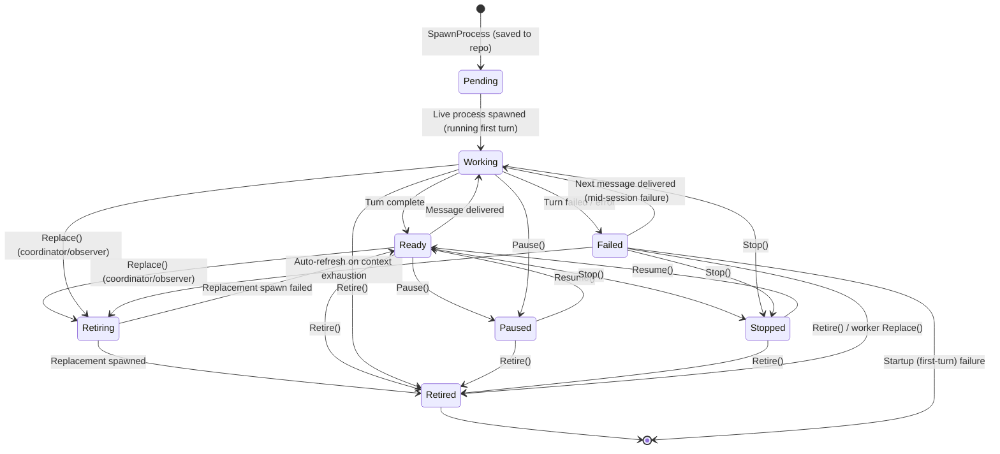
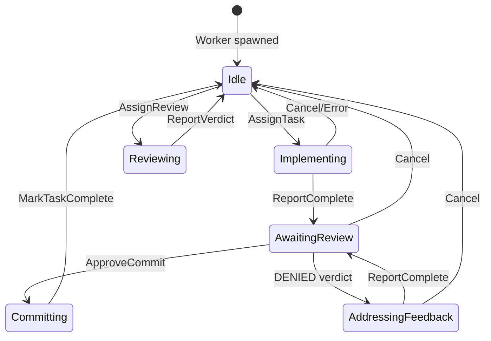
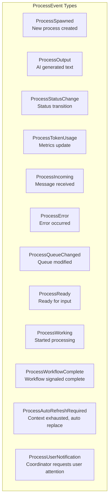
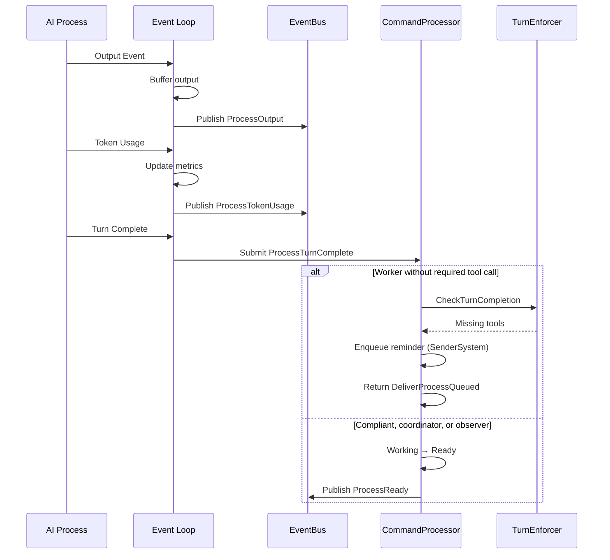
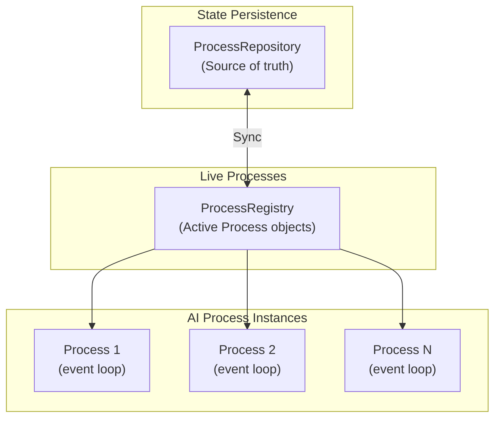
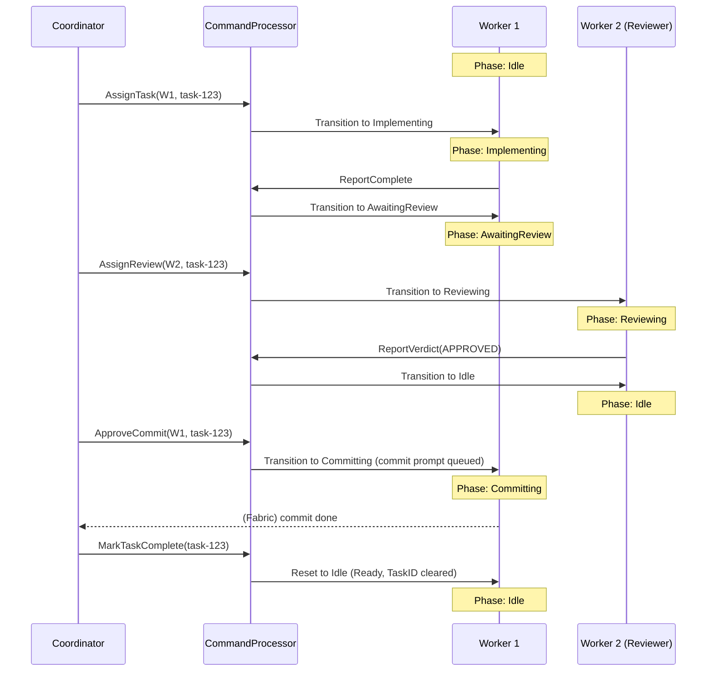

# Process Lifecycle and State Management

This document describes the lifecycle of processes (coordinator, workers, and the optional observer) in the v2 orchestration system, including status transitions, worker phases, and event emission.

## Process Types

The v2 system manages three types of processes:

| Type | Count | Purpose |
|------|-------|---------|
| **Coordinator** | 1 (singleton, ID `coordinator`) | Orchestrates work, doesn't write code |
| **Worker** | 1-N (IDs `worker-1`, `worker-2`, ...) | Executes tasks, writes code, performs reviews |
| **Observer** | 0-1 (singleton, ID `observer`; enabled by `orchestration.observer_enabled`, default false) | Passive monitor that reads all Fabric channels and writes only to #observer |

All roles use the same `Process` struct with role-based differentiation (`RoleCoordinator`, `RoleWorker`, `RoleObserver`). The observer has its own MCP server, and spawning a second one fails with `ErrObserverExists`. Like the coordinator, it is replaced spawn-before-retire and is auto-refreshed when its context is exhausted.

## Process Status State Machine


```mermaid
stateDiagram-v2
    [*] --> Pending : SpawnProcess (saved to repo)
    Pending --> Working : Live process spawned (running first turn)
    Working --> Ready : Turn complete
    Ready --> Working : Message delivered
    Working --> Failed : Turn failed / error
    Failed --> Working : Next message delivered (mid-session failure)
    Ready --> Paused : Pause()
    Working --> Paused : Pause()
    Paused --> Ready : Resume()
    Ready --> Stopped : Stop()
    Working --> Stopped : Stop()
    Failed --> Stopped : Stop()
    Stopped --> Ready : Resume()
    Ready --> Retiring : Replace() (coordinator/observer)
    Working --> Retiring : Replace() (coordinator/observer)
    Failed --> Retiring : Auto-refresh on context exhaustion
    Retiring --> Retired : Replacement spawned
    Retiring --> Ready : Replacement spawn failed
    Ready --> Retired : Retire()
    Working --> Retired : Retire()
    Paused --> Retired : Retire()
    Stopped --> Retired : Retire()
    Failed --> Retired : Retire() / worker Replace()
    Retired --> [*]
    Failed --> [*] : Startup (first-turn) failure
```

The diagram shows the common paths. `Stop()` accepts any status except `Stopped`/`Retired` (a worker in the `Committing` phase also needs `Force`), and `Retire()` any status except `Retired`. Worker replacement retires the old worker directly (no `Retiring`). Replacement processes skip `Working`: a new coordinator/observer is saved directly as `Ready`, and a replacement worker goes `Pending` -> `Ready`. With no spawner configured (tests), `SpawnProcess` saves `Ready` instead of `Working`.

### Status Definitions

| Status | Description | Terminal? |
|--------|-------------|-----------|
| `Pending` | Saved to the repository by `SpawnProcess`; live process not yet spawned | No |
| `Starting` | Defined, but never set by v2 handlers; only handled in UI rendering and adapter status mapping | No |
| `Ready` | Idle, waiting for input | No |
| `Working` | Actively processing an AI turn (including the first turn right after spawn) | No |
| `Paused` | Temporarily suspended by user; AI subprocess stopped | No |
| `Stopped` | Stopped via `Stop()` (queue drained, task cleared), can be resumed | No |
| `Retiring` | Coordinator/observer being replaced (spawn-before-retire); still live until the replacement spawns | No |
| `Retired` | Gracefully shut down | Yes |
| `Failed` | Turn failed. Startup (first-turn) failures and context-exhausted processes are effectively unrecoverable. Mid-session failures (`HasCompletedTurn=true`) recover when the next queued message is delivered | Treated as terminal by `IsTerminal()` and Pause/Resume, but not by Send/Deliver/Stop |

On a mid-session failure the repository status is `Failed`, but the emitted `ProcessError` event carries status `Ready`, and a `DeliverProcessQueued` follow-up delivers any messages queued during the failed turn. A context-exhausted coordinator or observer is auto-replaced; a context-exhausted worker stays `Failed` and the coordinator is sent an out-of-context message.

## Worker Phase State Machine

Workers have an additional **phase** layer that tracks their task workflow state:


```mermaid
stateDiagram-v2
    [*] --> Idle : Worker spawned
    
    Idle --> Implementing : AssignTask
    Idle --> Reviewing : AssignReview
    
    Implementing --> AwaitingReview : ReportComplete
    Implementing --> Idle : Cancel/Error
    
    AwaitingReview --> Committing : ApproveCommit
    AwaitingReview --> AddressingFeedback : DENIED verdict
    AwaitingReview --> Idle : Cancel
    
    AddressingFeedback --> AwaitingReview : ReportComplete
    AddressingFeedback --> Idle : Cancel
    
    Reviewing --> Idle : ReportVerdict
    
    Committing --> Idle : MarkTaskComplete
```

### Phase Definitions

| Phase | Description | Valid Transitions To |
|-------|-------------|---------------------|
| `Idle` | Ready for task assignment | Implementing, Reviewing |
| `Implementing` | Actively coding a task | AwaitingReview, Idle |
| `AwaitingReview` | Code complete, waiting for review | Committing, AddressingFeedback, Idle |
| `Reviewing` | Reviewing another worker's code | Idle |
| `AddressingFeedback` | Fixing review issues | AwaitingReview, Idle |
| `Committing` | Creating git commit | Idle |

### Phase Transition Validation

```go
var ValidTransitions = map[ProcessPhase][]ProcessPhase{
    Idle:               {Implementing, Reviewing},
    Implementing:       {AwaitingReview, Idle},
    AwaitingReview:     {Committing, AddressingFeedback, Idle},
    Reviewing:          {Idle},
    AddressingFeedback: {AwaitingReview, Idle},
    Committing:         {Idle},
}
```

## Process Struct

`repository.Process` is the persisted entity that handlers read and save (the source of truth for status and phase):

```go
type Process struct {
    ID               string              // "coordinator", "observer", "worker-1", etc.
    Role             ProcessRole         // RoleCoordinator, RoleWorker, or RoleObserver
    Status           ProcessStatus       // Current lifecycle status
    SessionID        string              // Claude/Amp session ID
    Metrics          *TokenMetrics       // Token usage and costs
    CreatedAt        time.Time
    LastActivityAt   time.Time
    HasCompletedTurn bool                // Distinguishes startup vs mid-session failures
    Phase            *ProcessPhase       // Worker-only: task phase
    TaskID           string              // Worker-only: current task
    RetiredAt        time.Time           // Zero if active
    AgentType        roles.AgentType     // Worker specialization: generic (""), implementer, reviewer, researcher
}
```

The live runtime object is `process.Process` (`v2/process/process.go`), which owns the AI subprocess, output buffer, and event loop. It is tracked in the [Process Registry](#process-registry).

## Event Types

The system emits events for all significant process state changes:


```mermaid
flowchart TB
    subgraph Events["ProcessEvent Types"]
        Spawned["ProcessSpawned<br/>New process created"]
        Output["ProcessOutput<br/>AI generated text"]
        StatusChange["ProcessStatusChange<br/>Status transition"]
        TokenUsage["ProcessTokenUsage<br/>Metrics update"]
        Incoming["ProcessIncoming<br/>Message received"]
        Error["ProcessError<br/>Error occurred"]
        QueueChanged["ProcessQueueChanged<br/>Queue modified"]
        Ready["ProcessReady<br/>Ready for input"]
        Working["ProcessWorking<br/>Started processing"]
        WorkflowComplete["ProcessWorkflowComplete<br/>Workflow signaled complete"]
        AutoRefresh["ProcessAutoRefreshRequired<br/>Context exhausted, auto replace"]
        UserNotify["ProcessUserNotification<br/>Coordinator requests user attention"]
    end
```

### ProcessEvent Structure

```go
type ProcessEvent struct {
    Type       ProcessEventType    // Event type enum
    ProcessID  string              // Which process
    Role       ProcessRole         // Coordinator, Worker, or Observer
    Timestamp  time.Time           // Set by NewProcessEvent
    Output     string              // For output events
    Delta      bool                // Streaming chunk to merge with the previous output
    Status     ProcessStatus       // For status changes
    Phase      *ProcessPhase       // Worker phase (if applicable)
    TaskID     string              // Worker task (if applicable)
    Metrics    *TokenMetrics       // For token usage events
    Message    string              // For incoming events
    Sender     string              // For ProcessIncoming: "user", "coordinator", or "system"
    Error      error               // For error events
    RawJSON    []byte              // Raw API response
    QueueCount int                 // Pending queue messages
}
```

Events are built with `events.NewProcessEvent(type, processID, role)`, which sets `Timestamp`, followed by chained `WithX(...)` builders (`WithOutput`, `WithStatus`, `WithSender`, ...).

## Process Event Loop

Each process runs an event loop that handles AI process events:


```mermaid
sequenceDiagram
    participant AI as AI Process
    participant EL as Event Loop
    participant EB as EventBus
    participant CP as CommandProcessor
    participant TE as TurnEnforcer
    
    AI->>EL: Output Event
    EL->>EL: Buffer output
    EL->>EB: Publish ProcessOutput
    
    AI->>EL: Token Usage
    EL->>EL: Update metrics
    EL->>EB: Publish ProcessTokenUsage
    
    AI->>EL: Turn Complete
    EL->>CP: Submit ProcessTurnComplete
    
    alt Worker without required tool call
        CP->>TE: CheckTurnCompletion
        TE-->>CP: Missing tools
        CP->>CP: Enqueue reminder (SenderSystem)
        CP->>CP: Return DeliverProcessQueued
    else Compliant, coordinator, or observer
        CP->>CP: Working → Ready
        CP->>EB: Publish ProcessReady
    end
```

### Event Loop Implementation

```go
func (p *Process) eventLoop() {
    defer close(p.eventDone)

    p.mu.Lock()
    proc := p.proc
    p.sessionIDAtTurnStart = p.sessionID // Restored if the AI process exits unsuccessfully
    p.mu.Unlock()
    if proc == nil {
        return
    }

    procEvents := proc.Events()
    procErrors := proc.Errors()

    // Wait for BOTH channels to close so every error is processed
    var eventsClosed, errorsClosed bool
    for !eventsClosed || !errorsClosed {
        select {
        case <-p.ctx.Done():
            return

        case event, ok := <-procEvents:
            if !ok {
                eventsClosed = true
                procEvents = nil // Nil channel blocks; prevents busy loop
                continue
            }
            p.handleOutputEvent(&event)

        case err, ok := <-procErrors:
            if !ok {
                errorsClosed = true
                procErrors = nil
                continue
            }
            p.handleError(err)
        }
    }

    p.handleProcessComplete() // Submits ProcessTurnCompleteCommand
}
```

## Turn Completion Enforcement

Workers are required to call specific MCP tools to properly complete their turn. This ensures workers always communicate their state back to the coordinator.

### Required Tools

| Tool | Purpose |
|------|---------|
| `fabric_send` | Post a message to a Fabric channel |
| `fabric_reply` | Reply in a Fabric thread |
| `fabric_ack` | Acknowledge a Fabric message |
| `fabric_join` | Join Fabric and signal ready (called on the first turn after spawn) |
| `report_implementation_complete` | Report task implementation done |
| `report_review_verdict` | Report code review result |

Calling any one of these satisfies the turn (`handler.RequiredTools`). Only workers are enforced; the coordinator and observer are not. See [Fabric Messaging Integration](./message-flow.md#fabric-messaging-integration) for the Fabric tools.

### Enforcement Mechanism

The `TurnCompletionEnforcer` (implemented by `TurnCompletionTracker`) tracks tool calls during each turn:

```go
type TurnCompletionEnforcer interface {
    RecordToolCall(processID, toolName string)                                  // Called from worker MCP handlers
    ResetTurn(processID string)                                                 // Clear state for new turn
    MarkAsNewlySpawned(processID string)                                        // Called by SpawnProcessHandler
    CheckTurnCompletion(processID string, role repository.ProcessRole) []string // Returns missing tools
    IsNewlySpawned(processID string) bool                                       // First turn after spawn is exempt
    ShouldRetry(processID string) bool                                          // Check retry limit
    IncrementRetry(processID string)                                            // Increment retry count
    GetReminderMessage(processID string, missingTools []string) string          // Build reminder prompt
    OnMaxRetriesExceeded(processID string, missingTools []string)               // Hook; logs only if a logger is set
    CleanupProcess(processID string)                                            // Called by RetireProcessHandler
}
```

### Enforcement Flow

1. **Turn completes** without required tool call
2. **Check exemptions**: Failed turns and newly spawned workers (`IsNewlySpawned`) are exempt. Only `SpawnProcess` marks a worker as newly spawned; a replacement worker's first turn is enforced, which its startup `fabric_join` call normally satisfies
3. **Retry check**: If retries < 2, enqueue the `GetReminderMessage` reminder as `SenderSystem` and set the worker `Ready`
4. **Delivery**: Reminder delivered via `DeliverProcessQueuedHandler`
5. **Preserve state**: Delivering a `SenderSystem` message doesn't reset turn tracking (recorded tool calls, retry count, first-turn exemption)
6. **Max exceeded**: After 2 retries, `OnMaxRetriesExceeded` is called and the turn completes normally. It logs a warning only when the tracker was built with `WithLogger`; the production tracker (`NewTurnCompletionTracker()`) has no logger, so nothing is logged

### Sender Types

| Type | Description | Resets Turn? |
|------|-------------|--------------|
| `SenderUser` | Message from TUI user | Yes |
| `SenderCoordinator` | Prompts queued on the coordinator's behalf (task, review, commit, feedback, aggregation) | Yes |
| `SenderSystem` | System-generated: enforcement reminders, worker out-of-context notices, and every `SourceInternal` send (Fabric nudges, broadcasts, health-recovery nudges) | No |

## Output Buffer

Each process maintains a ring buffer for recent output:

```go
type OutputBuffer struct {
    lines    []string  // Fixed-size array (default 100)
    capacity int
    start    int       // Index of oldest line
    count    int       // Lines stored
}
```

**Methods:**
- `Append(line)` - Add line, evict oldest if full
- `Lines()` - All lines chronologically (copy)
- `Last(n)` - Last n lines
- `Clear()` - Empty buffer

## Process Registry

The `ProcessRegistry` tracks live `Process` instances for runtime operations:


```mermaid
flowchart TB
    subgraph Persistence["State Persistence"]
        PR["ProcessRepository<br/>(Source of truth)"]
    end
    
    subgraph Runtime["Live Processes"]
        REG["ProcessRegistry<br/>(Active Process objects)"]
    end
    
    subgraph Processes["AI Process Instances"]
        P1["Process 1<br/>(event loop)"]
        P2["Process 2<br/>(event loop)"]
        PN["Process N<br/>(event loop)"]
    end
    
    PR <-->|Sync| REG
    REG --> P1
    REG --> P2
    REG --> PN
```

**Registry Methods:**
```go
Register(p *Process)                                               // Add/replace process
Unregister(id string) bool                                         // Remove process; true if removed
Get(id string) *Process                                            // Get by ID
GetCoordinator() *Process                                          // Get coordinator
Workers() []*Process                                               // All workers (copy)
ActiveCount() int                                                  // Non-retired workers
All() []*Process                                                   // All processes (copy)
IDs() []string                                                     // All registered process IDs
StopAll()                                                          // Stop every registered process (shutdown)
ResumeProcess(processID string, proc client.HeadlessProcess) error // Resume with new AI process
```

## Token Metrics

Each process tracks token usage across turns:

```go
type TokenMetrics struct { // internal/orchestration/metrics
    TokensUsed        int       // Cumulative context tokens (input + cache_read + cache_create)
    TotalTokens       int       // Context window size
    OutputTokens      int       // Tokens generated this turn
    TurnCostUSD       float64   // This turn's cost
    TotalCostUSD      float64   // Published as the turn cost; the session accumulates its own total
    CumulativeCostUSD float64   // Running total across turns
    LastUpdatedAt     time.Time
}
// Helpers: ContextUsage(), FormatContextDisplay(), FormatCostDisplay()
```

### Cumulative Cost Tracking

```go
func (p *Process) setMetrics(m *TokenMetrics) {
    p.cumulativeCostUSD += m.TurnCostUSD
    m.CumulativeCostUSD = p.cumulativeCostUSD
    m.TotalCostUSD = m.TurnCostUSD // Publish turn cost; session accumulates its own total
    p.metrics = m
}
```

`TotalCostUSD` deliberately carries the turn cost, not the cumulative cost, so the session doesn't count costs twice; only `CumulativeCostUSD` holds the running total. Cost-only result events (`Usage == nil`, `TotalCostUSD > 0`) take a separate path: `addTurnCost` adds to the cumulative total and `publishCostEvent` emits a cost-only `ProcessTokenUsage` event.

## Complete Task Workflow Example


```mermaid
sequenceDiagram
    participant Coord as Coordinator
    participant CP as CommandProcessor
    participant W1 as Worker 1
    participant W2 as Worker 2 (Reviewer)
    
    Note over W1: Phase: Idle
    
    Coord->>CP: AssignTask(W1, task-123)
    CP->>W1: Transition to Implementing
    Note over W1: Phase: Implementing
    
    W1->>CP: ReportComplete
    CP->>W1: Transition to AwaitingReview
    Note over W1: Phase: AwaitingReview
    
    Coord->>CP: AssignReview(W2, task-123)
    CP->>W2: Transition to Reviewing
    Note over W2: Phase: Reviewing
    
    W2->>CP: ReportVerdict(APPROVED)
    CP->>W2: Transition to Idle
    Note over W2: Phase: Idle
    
    Coord->>CP: ApproveCommit(W1, task-123)
    CP->>W1: Transition to Committing (commit prompt queued)
    Note over W1: Phase: Committing
    
    W1-->>Coord: (Fabric) commit done
    Coord->>CP: MarkTaskComplete(task-123)
    CP->>W1: Reset to Idle (Ready, TaskID cleared)
    Note over W1: Phase: Idle
```

## Concurrency Patterns

### 1. Mutex Protection
All mutable process state protected by `sync.RWMutex`.

### 2. Context-Based Cancellation
```go
ctx, cancel := context.WithCancel(context.Background())
// In event loop:
case <-p.ctx.Done():
    return  // Clean exit
```

### 3. Done Channel Synchronization
```go
eventDone := make(chan struct{})
// In goroutine:
defer close(p.eventDone)
// To wait:
<-p.eventDone
```

### 4. Copy-on-Read
Registry returns slice copies to prevent data races:
```go
func (r *ProcessRegistry) All() []*Process {
    r.mu.RLock()
    defer r.mu.RUnlock()
    result := make([]*Process, 0, len(r.processes))
    for _, p := range r.processes {
        result = append(result, p)
    }
    return result
}
```
